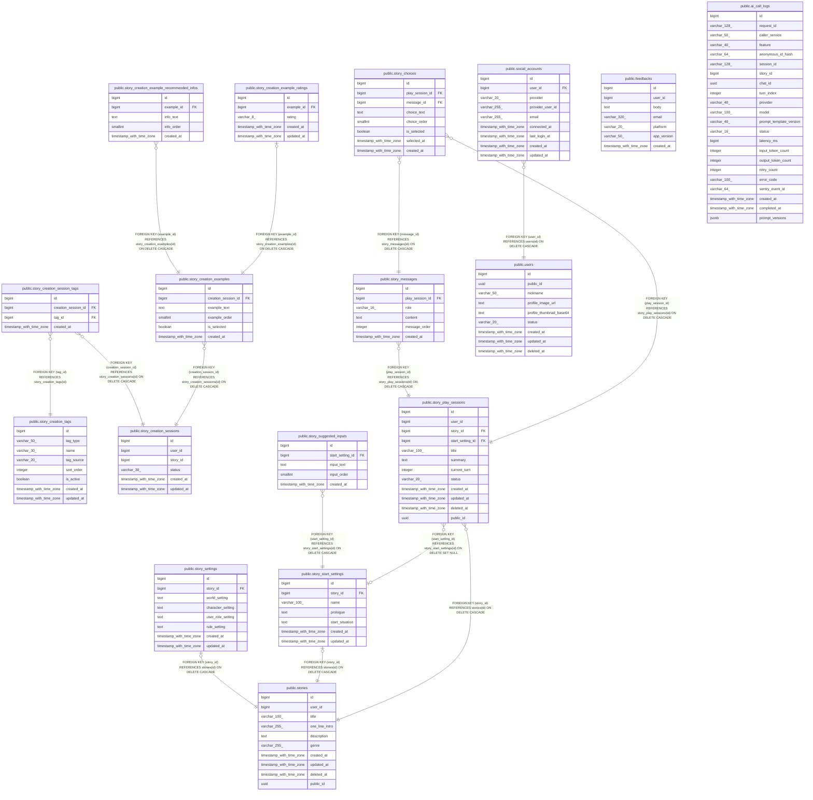

# manyak

## Tables

| Name | Columns | Comment | Type |
| ---- | ------- | ------- | ---- |
| [public.story_creation_tags](public.story_creation_tags.md) | 8 |  | BASE TABLE |
| [public.story_creation_sessions](public.story_creation_sessions.md) | 6 |  | BASE TABLE |
| [public.story_creation_session_tags](public.story_creation_session_tags.md) | 4 |  | BASE TABLE |
| [public.story_creation_examples](public.story_creation_examples.md) | 6 |  | BASE TABLE |
| [public.story_creation_example_recommended_infos](public.story_creation_example_recommended_infos.md) | 5 |  | BASE TABLE |
| [public.stories](public.stories.md) | 10 |  | BASE TABLE |
| [public.story_settings](public.story_settings.md) | 8 |  | BASE TABLE |
| [public.story_start_settings](public.story_start_settings.md) | 7 |  | BASE TABLE |
| [public.story_suggested_inputs](public.story_suggested_inputs.md) | 5 |  | BASE TABLE |
| [public.story_play_sessions](public.story_play_sessions.md) | 12 |  | BASE TABLE |
| [public.story_messages](public.story_messages.md) | 6 |  | BASE TABLE |
| [public.story_choices](public.story_choices.md) | 8 |  | BASE TABLE |
| [public.story_creation_example_ratings](public.story_creation_example_ratings.md) | 5 |  | BASE TABLE |
| [public.feedbacks](public.feedbacks.md) | 7 |  | BASE TABLE |
| [public.ai_call_logs](public.ai_call_logs.md) | 22 |  | BASE TABLE |
| [public.users](public.users.md) | 9 |  | BASE TABLE |
| [public.social_accounts](public.social_accounts.md) | 9 |  | BASE TABLE |

## Relations

---

> Generated by [tbls](https://github.com/k1LoW/tbls)
