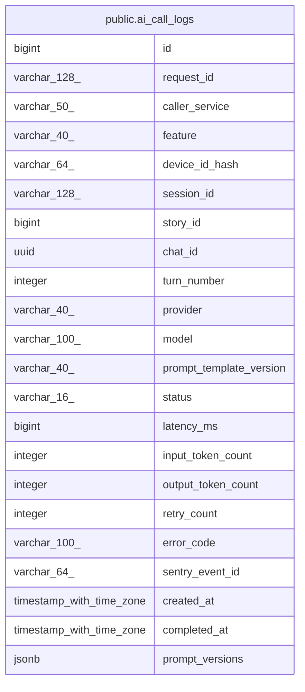

# public.ai_call_logs

## Columns

| Name | Type | Default | Nullable | Children | Parents | Comment |
| ---- | ---- | ------- | -------- | -------- | ------- | ------- |
| id | bigint | nextval('ai_call_logs_id_seq'::regclass) | false |  |  |  |
| request_id | varchar(128) |  | false |  |  |  |
| caller_service | varchar(50) |  | false |  |  |  |
| feature | varchar(40) |  | false |  |  |  |
| device_id_hash | varchar(64) |  | true |  |  |  |
| session_id | varchar(128) |  | true |  |  |  |
| story_id | bigint |  | true |  |  |  |
| chat_id | uuid |  | true |  |  |  |
| turn_number | integer |  | true |  |  |  |
| provider | varchar(40) |  | true |  |  |  |
| model | varchar(100) |  | true |  |  |  |
| prompt_template_version | varchar(40) |  | true |  |  |  |
| status | varchar(16) |  | false |  |  |  |
| latency_ms | bigint |  | true |  |  |  |
| input_token_count | integer |  | true |  |  |  |
| output_token_count | integer |  | true |  |  |  |
| retry_count | integer | 0 | false |  |  |  |
| error_code | varchar(100) |  | true |  |  |  |
| sentry_event_id | varchar(64) |  | true |  |  |  |
| created_at | timestamp with time zone | now() | false |  |  |  |
| completed_at | timestamp with time zone |  | true |  |  |  |
| prompt_versions | jsonb |  | true |  |  |  |

## Constraints

| Name | Type | Definition |
| ---- | ---- | ---------- |
| ck_ai_call_logs_feature | CHECK | CHECK (((feature)::text = ANY ((ARRAY['storyline_generation'::character varying, 'story_completion'::character varying, 'chat_response'::character varying, 'choice_generation'::character varying])::text[]))) |
| ck_ai_call_logs_latency | CHECK | CHECK (((latency_ms IS NULL) OR (latency_ms >= 0))) |
| ck_ai_call_logs_retry_count | CHECK | CHECK ((retry_count >= 0)) |
| ck_ai_call_logs_status | CHECK | CHECK (((status)::text = ANY ((ARRAY['STARTED'::character varying, 'SUCCEEDED'::character varying, 'FAILED'::character varying])::text[]))) |
| ck_ai_call_logs_turn_number | CHECK | CHECK (((turn_number IS NULL) OR (turn_number >= 0))) |
| ai_call_logs_pkey | PRIMARY KEY | PRIMARY KEY (id) |

## Indexes

| Name | Definition |
| ---- | ---------- |
| ai_call_logs_pkey | CREATE UNIQUE INDEX ai_call_logs_pkey ON public.ai_call_logs USING btree (id) |
| idx_ai_call_logs_request_id | CREATE INDEX idx_ai_call_logs_request_id ON public.ai_call_logs USING btree (request_id) |
| idx_ai_call_logs_created_at | CREATE INDEX idx_ai_call_logs_created_at ON public.ai_call_logs USING btree (created_at DESC) |
| idx_ai_call_logs_story | CREATE INDEX idx_ai_call_logs_story ON public.ai_call_logs USING btree (story_id) |

## Relations

---

> Generated by [tbls](https://github.com/k1LoW/tbls)
