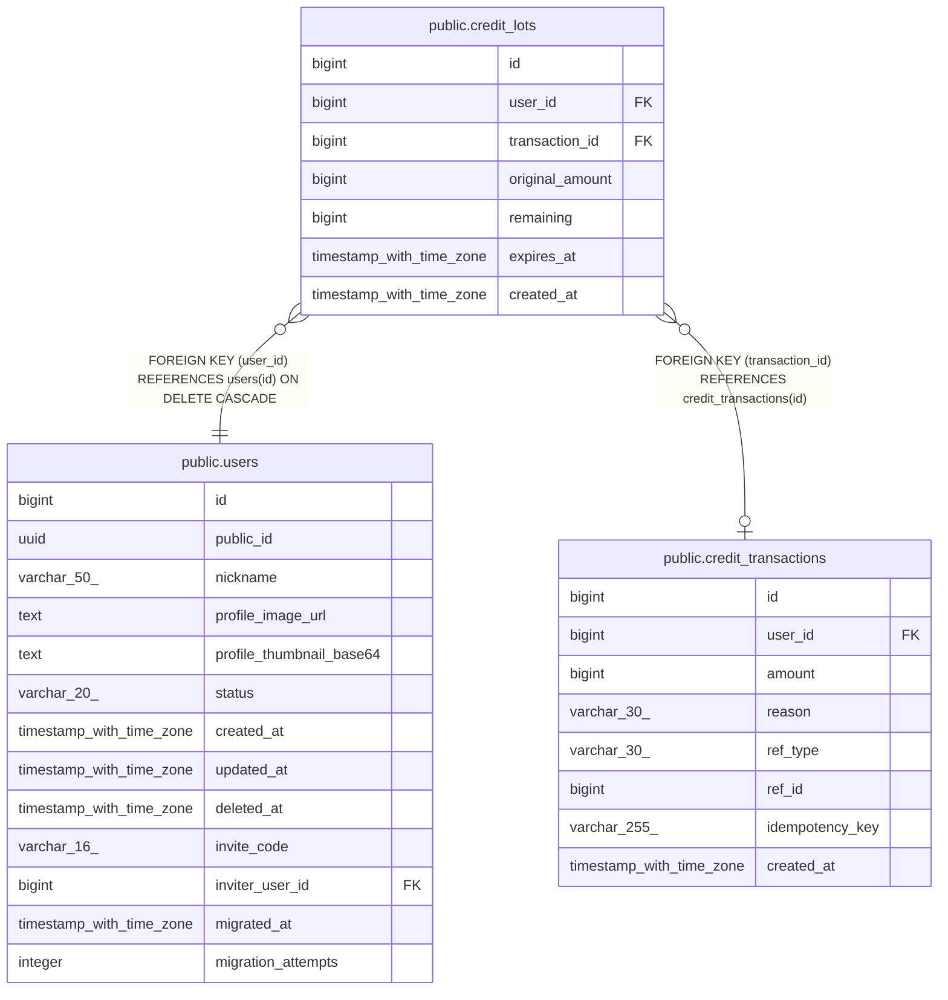

# public.credit_lots

## Columns

| Name | Type | Default | Nullable | Children | Parents | Comment |
| ---- | ---- | ------- | -------- | -------- | ------- | ------- |
| id | bigint | nextval('credit_lots_id_seq'::regclass) | false |  |  |  |
| user_id | bigint |  | false |  | [public.users](public.users.md) |  |
| transaction_id | bigint |  | true |  | [public.credit_transactions](public.credit_transactions.md) |  |
| original_amount | bigint |  | false |  |  |  |
| remaining | bigint |  | false |  |  |  |
| expires_at | timestamp with time zone |  | true |  |  |  |
| created_at | timestamp with time zone | now() | false |  |  |  |

## Constraints

| Name | Type | Definition |
| ---- | ---- | ---------- |
| ck_credit_lots_original_positive | CHECK | CHECK ((original_amount > 0)) |
| ck_credit_lots_remaining_range | CHECK | CHECK (((remaining >= 0) AND (remaining <= original_amount))) |
| credit_lots_user_id_fkey | FOREIGN KEY | FOREIGN KEY (user_id) REFERENCES users(id) ON DELETE CASCADE |
| credit_lots_transaction_id_fkey | FOREIGN KEY | FOREIGN KEY (transaction_id) REFERENCES credit_transactions(id) |
| credit_lots_pkey | PRIMARY KEY | PRIMARY KEY (id) |

## Indexes

| Name | Definition |
| ---- | ---------- |
| credit_lots_pkey | CREATE UNIQUE INDEX credit_lots_pkey ON public.credit_lots USING btree (id) |
| idx_credit_lots_user_active | CREATE INDEX idx_credit_lots_user_active ON public.credit_lots USING btree (user_id, expires_at) WHERE (remaining > 0) |

## Relations

---

> Generated by [tbls](https://github.com/k1LoW/tbls)
