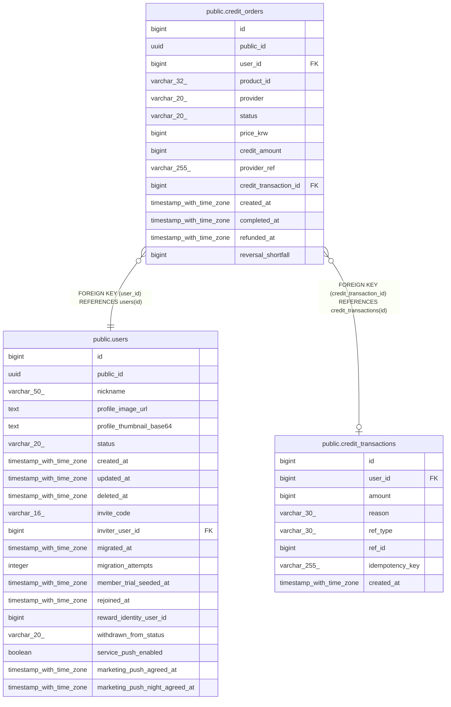

# public.credit_orders

## Columns

| Name | Type | Default | Nullable | Children | Parents | Comment |
| ---- | ---- | ------- | -------- | -------- | ------- | ------- |
| id | bigint | nextval('credit_orders_id_seq'::regclass) | false |  |  |  |
| public_id | uuid |  | false |  |  |  |
| user_id | bigint |  | false |  | [public.users](public.users.md) |  |
| product_id | varchar(32) |  | false |  |  |  |
| provider | varchar(20) |  | false |  |  |  |
| status | varchar(20) |  | false |  |  |  |
| price_krw | bigint |  | false |  |  |  |
| credit_amount | bigint |  | false |  |  |  |
| provider_ref | varchar(255) |  | true |  |  |  |
| credit_transaction_id | bigint |  | true |  | [public.credit_transactions](public.credit_transactions.md) |  |
| created_at | timestamp with time zone | now() | false |  |  |  |
| completed_at | timestamp with time zone |  | true |  |  |  |
| refunded_at | timestamp with time zone |  | true |  |  |  |
| reversal_shortfall | bigint |  | true |  |  |  |

## Constraints

| Name | Type | Definition |
| ---- | ---- | ---------- |
| ck_credit_orders_provider | CHECK | CHECK (((provider)::text = ANY ((ARRAY['GROBLE'::character varying, 'GOOGLE_PLAY'::character varying])::text[]))) |
| ck_credit_orders_status | CHECK | CHECK (((status)::text = ANY ((ARRAY['PENDING'::character varying, 'COMPLETED'::character varying, 'REFUNDED'::character varying])::text[]))) |
| credit_orders_user_id_fkey | FOREIGN KEY | FOREIGN KEY (user_id) REFERENCES users(id) |
| credit_orders_credit_transaction_id_fkey | FOREIGN KEY | FOREIGN KEY (credit_transaction_id) REFERENCES credit_transactions(id) |
| credit_orders_pkey | PRIMARY KEY | PRIMARY KEY (id) |
| credit_orders_public_id_key | UNIQUE | UNIQUE (public_id) |
| credit_orders_provider_ref_key | UNIQUE | UNIQUE (provider_ref) |

## Indexes

| Name | Definition |
| ---- | ---------- |
| credit_orders_pkey | CREATE UNIQUE INDEX credit_orders_pkey ON public.credit_orders USING btree (id) |
| credit_orders_public_id_key | CREATE UNIQUE INDEX credit_orders_public_id_key ON public.credit_orders USING btree (public_id) |
| credit_orders_provider_ref_key | CREATE UNIQUE INDEX credit_orders_provider_ref_key ON public.credit_orders USING btree (provider_ref) |
| idx_credit_orders_user_created_at | CREATE INDEX idx_credit_orders_user_created_at ON public.credit_orders USING btree (user_id, created_at DESC) |

## Relations

---

> Generated by [tbls](https://github.com/k1LoW/tbls)
