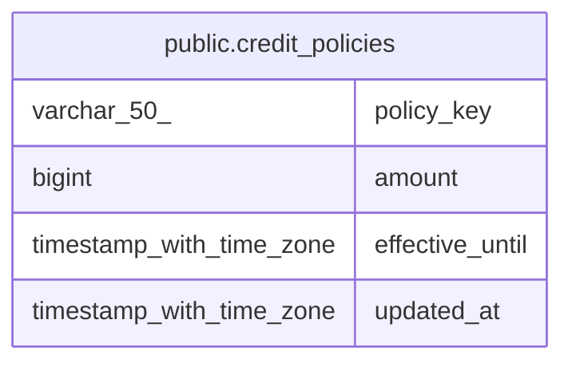

# public.credit_policies

## Columns

| Name | Type | Default | Nullable | Children | Parents | Comment |
| ---- | ---- | ------- | -------- | -------- | ------- | ------- |
| policy_key | varchar(50) |  | false |  |  |  |
| amount | bigint |  | false |  |  |  |
| effective_until | timestamp with time zone |  | true |  |  |  |
| updated_at | timestamp with time zone | now() | false |  |  |  |

## Constraints

| Name | Type | Definition |
| ---- | ---- | ---------- |
| ck_credit_policies_amount | CHECK | CHECK (((amount >= 0) AND (amount <= 10000))) |
| credit_policies_pkey | PRIMARY KEY | PRIMARY KEY (policy_key) |

## Indexes

| Name | Definition |
| ---- | ---------- |
| credit_policies_pkey | CREATE UNIQUE INDEX credit_policies_pkey ON public.credit_policies USING btree (policy_key) |

## Relations

---

> Generated by [tbls](https://github.com/k1LoW/tbls)
