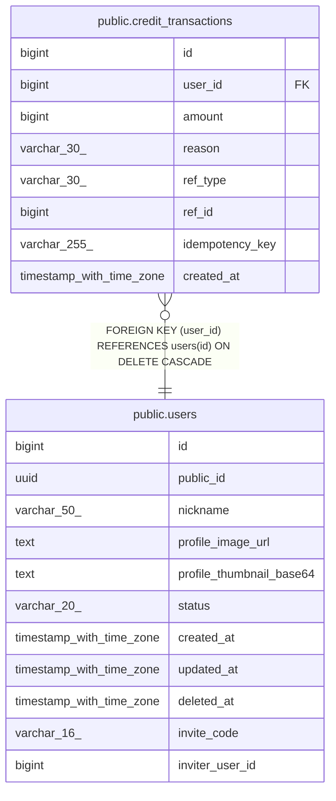

# public.credit_transactions

## Columns

| Name | Type | Default | Nullable | Children | Parents | Comment |
| ---- | ---- | ------- | -------- | -------- | ------- | ------- |
| id | bigint | nextval('credit_transactions_id_seq'::regclass) | false |  |  |  |
| user_id | bigint |  | false |  | [public.users](public.users.md) |  |
| amount | bigint |  | false |  |  |  |
| reason | varchar(30) |  | false |  |  |  |
| ref_type | varchar(30) |  | true |  |  |  |
| ref_id | bigint |  | true |  |  |  |
| idempotency_key | varchar(255) |  | true |  |  |  |
| created_at | timestamp with time zone | now() | false |  |  |  |

## Constraints

| Name | Type | Definition |
| ---- | ---- | ---------- |
| ck_credit_transactions_amount | CHECK | CHECK ((amount <> 0)) |
| ck_credit_transactions_reason | CHECK | CHECK (((reason)::text = ANY ((ARRAY['SIGNUP_REWARD'::character varying, 'INVITE_REWARD'::character varying, 'ATTENDANCE_REWARD'::character varying, 'STORY_CREATION'::character varying, 'CHAT_TURN'::character varying, 'REFUND'::character varying, 'PURCHASE'::character varying])::text[]))) |
| credit_transactions_user_id_fkey | FOREIGN KEY | FOREIGN KEY (user_id) REFERENCES users(id) ON DELETE CASCADE |
| credit_transactions_pkey | PRIMARY KEY | PRIMARY KEY (id) |
| uq_credit_transactions_idempotency | UNIQUE | UNIQUE (idempotency_key) |

## Indexes

| Name | Definition |
| ---- | ---------- |
| credit_transactions_pkey | CREATE UNIQUE INDEX credit_transactions_pkey ON public.credit_transactions USING btree (id) |
| uq_credit_transactions_idempotency | CREATE UNIQUE INDEX uq_credit_transactions_idempotency ON public.credit_transactions USING btree (idempotency_key) |
| idx_credit_transactions_user | CREATE INDEX idx_credit_transactions_user ON public.credit_transactions USING btree (user_id) |

## Relations

---

> Generated by [tbls](https://github.com/k1LoW/tbls)
