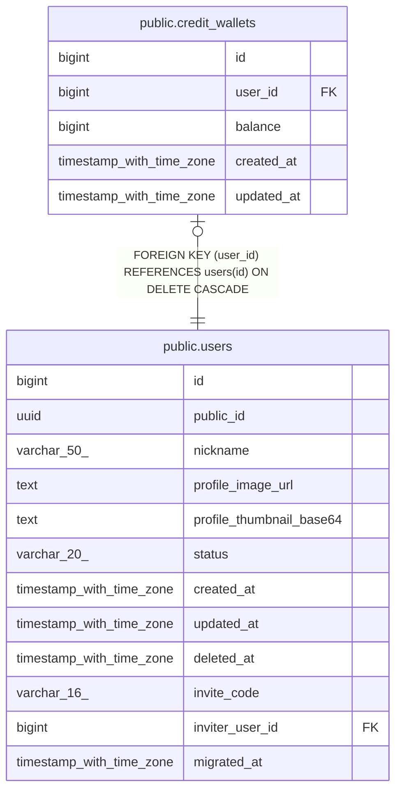

# public.credit_wallets

## Columns

| Name | Type | Default | Nullable | Children | Parents | Comment |
| ---- | ---- | ------- | -------- | -------- | ------- | ------- |
| id | bigint | nextval('credit_wallets_id_seq'::regclass) | false |  |  |  |
| user_id | bigint |  | false |  | [public.users](public.users.md) |  |
| balance | bigint | 0 | false |  |  |  |
| created_at | timestamp with time zone | now() | false |  |  |  |
| updated_at | timestamp with time zone | now() | false |  |  |  |

## Constraints

| Name | Type | Definition |
| ---- | ---- | ---------- |
| ck_credit_wallets_balance | CHECK | CHECK ((balance >= 0)) |
| credit_wallets_user_id_fkey | FOREIGN KEY | FOREIGN KEY (user_id) REFERENCES users(id) ON DELETE CASCADE |
| credit_wallets_pkey | PRIMARY KEY | PRIMARY KEY (id) |
| uq_credit_wallets_user | UNIQUE | UNIQUE (user_id) |

## Indexes

| Name | Definition |
| ---- | ---------- |
| credit_wallets_pkey | CREATE UNIQUE INDEX credit_wallets_pkey ON public.credit_wallets USING btree (id) |
| uq_credit_wallets_user | CREATE UNIQUE INDEX uq_credit_wallets_user ON public.credit_wallets USING btree (user_id) |

## Relations

---

> Generated by [tbls](https://github.com/k1LoW/tbls)
