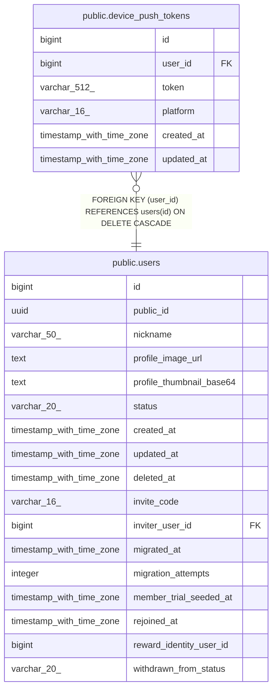

# public.device_push_tokens

## Columns

| Name | Type | Default | Nullable | Children | Parents | Comment |
| ---- | ---- | ------- | -------- | -------- | ------- | ------- |
| id | bigint | nextval('device_push_tokens_id_seq'::regclass) | false |  |  |  |
| user_id | bigint |  | false |  | [public.users](public.users.md) |  |
| token | varchar(512) |  | false |  |  |  |
| platform | varchar(16) |  | false |  |  |  |
| created_at | timestamp with time zone | now() | false |  |  |  |
| updated_at | timestamp with time zone | now() | false |  |  |  |

## Constraints

| Name | Type | Definition |
| ---- | ---- | ---------- |
| ck_device_push_tokens_platform | CHECK | CHECK (((platform)::text = 'ANDROID'::text)) |
| device_push_tokens_user_id_fkey | FOREIGN KEY | FOREIGN KEY (user_id) REFERENCES users(id) ON DELETE CASCADE |
| device_push_tokens_pkey | PRIMARY KEY | PRIMARY KEY (id) |
| uq_device_push_tokens_token | UNIQUE | UNIQUE (token) |

## Indexes

| Name | Definition |
| ---- | ---------- |
| device_push_tokens_pkey | CREATE UNIQUE INDEX device_push_tokens_pkey ON public.device_push_tokens USING btree (id) |
| uq_device_push_tokens_token | CREATE UNIQUE INDEX uq_device_push_tokens_token ON public.device_push_tokens USING btree (token) |
| idx_device_push_tokens_user | CREATE INDEX idx_device_push_tokens_user ON public.device_push_tokens USING btree (user_id) |

## Relations

---

> Generated by [tbls](https://github.com/k1LoW/tbls)
