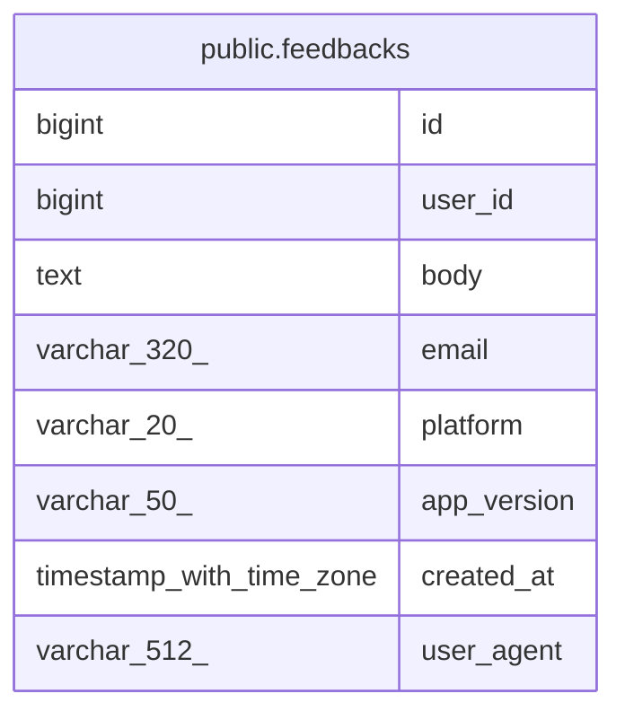

# public.feedbacks

## Columns

| Name | Type | Default | Nullable | Children | Parents | Comment |
| ---- | ---- | ------- | -------- | -------- | ------- | ------- |
| id | bigint | nextval('feedbacks_id_seq'::regclass) | false |  |  |  |
| user_id | bigint |  | true |  |  |  |
| body | text |  | false |  |  |  |
| email | varchar(320) |  | true |  |  |  |
| platform | varchar(20) |  | true |  |  |  |
| app_version | varchar(50) |  | true |  |  |  |
| created_at | timestamp with time zone | now() | false |  |  |  |
| user_agent | varchar(512) |  | true |  |  |  |

## Constraints

| Name | Type | Definition |
| ---- | ---- | ---------- |
| ck_feedbacks_body_not_blank | CHECK | CHECK ((length(btrim(body)) > 0)) |
| ck_feedbacks_platform | CHECK | CHECK (((platform IS NULL) OR ((platform)::text = ANY ((ARRAY['IOS'::character varying, 'ANDROID'::character varying, 'WEB'::character varying])::text[])))) |
| feedbacks_pkey | PRIMARY KEY | PRIMARY KEY (id) |

## Indexes

| Name | Definition |
| ---- | ---------- |
| feedbacks_pkey | CREATE UNIQUE INDEX feedbacks_pkey ON public.feedbacks USING btree (id) |
| idx_feedbacks_created_at | CREATE INDEX idx_feedbacks_created_at ON public.feedbacks USING btree (created_at DESC) |

## Relations

---

> Generated by [tbls](https://github.com/k1LoW/tbls)
