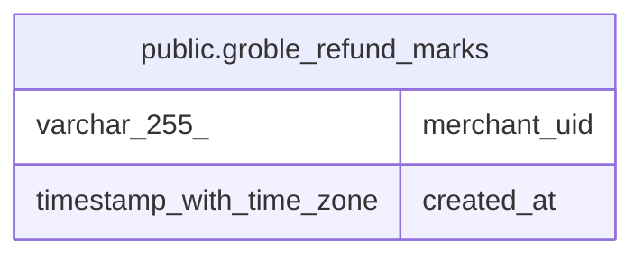

# public.groble_refund_marks

## Columns

| Name | Type | Default | Nullable | Children | Parents | Comment |
| ---- | ---- | ------- | -------- | -------- | ------- | ------- |
| merchant_uid | varchar(255) |  | false |  |  |  |
| created_at | timestamp with time zone | now() | false |  |  |  |

## Constraints

| Name | Type | Definition |
| ---- | ---- | ---------- |
| groble_refund_marks_pkey | PRIMARY KEY | PRIMARY KEY (merchant_uid) |

## Indexes

| Name | Definition |
| ---- | ---------- |
| groble_refund_marks_pkey | CREATE UNIQUE INDEX groble_refund_marks_pkey ON public.groble_refund_marks USING btree (merchant_uid) |

## Relations

---

> Generated by [tbls](https://github.com/k1LoW/tbls)
