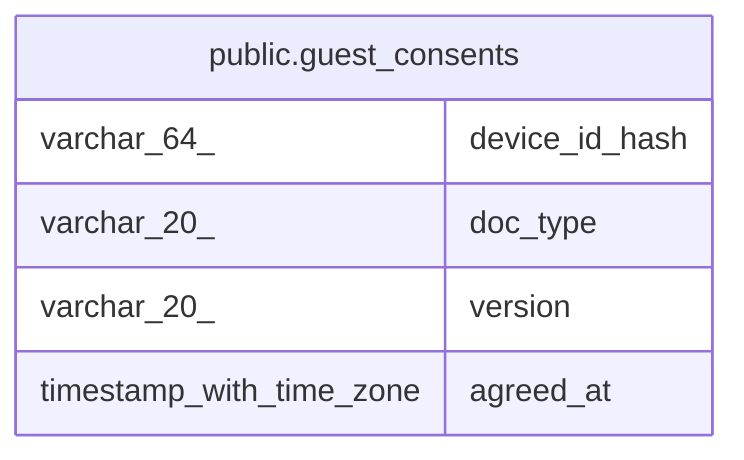

# public.guest_consents

## Columns

| Name | Type | Default | Nullable | Children | Parents | Comment |
| ---- | ---- | ------- | -------- | -------- | ------- | ------- |
| device_id_hash | varchar(64) |  | false |  |  |  |
| doc_type | varchar(20) |  | false |  |  |  |
| version | varchar(20) |  | false |  |  |  |
| agreed_at | timestamp with time zone | now() | false |  |  |  |

## Constraints

| Name | Type | Definition |
| ---- | ---- | ---------- |
| guest_consents_doc_type_check | CHECK | CHECK (((doc_type)::text = 'GUEST_PRIVACY'::text)) |
| guest_consents_pkey | PRIMARY KEY | PRIMARY KEY (device_id_hash, doc_type, version) |

## Indexes

| Name | Definition |
| ---- | ---------- |
| guest_consents_pkey | CREATE UNIQUE INDEX guest_consents_pkey ON public.guest_consents USING btree (device_id_hash, doc_type, version) |

## Relations

---

> Generated by [tbls](https://github.com/k1LoW/tbls)
