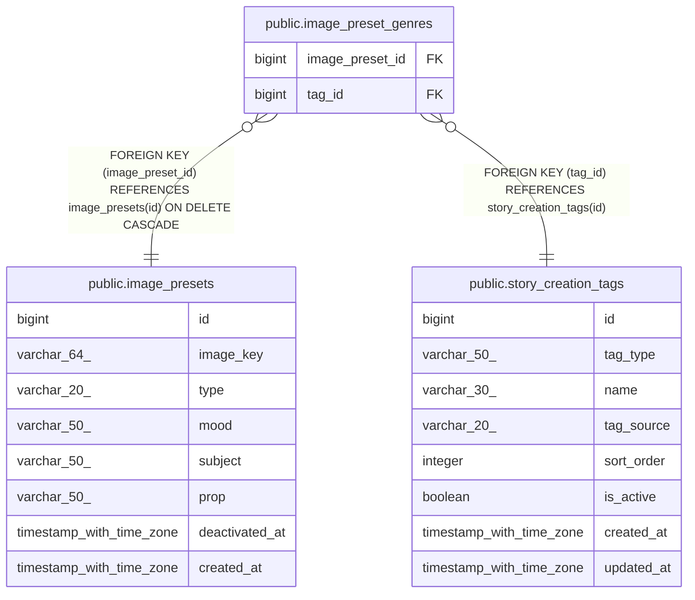

# public.image_preset_genres

## Columns

| Name | Type | Default | Nullable | Children | Parents | Comment |
| ---- | ---- | ------- | -------- | -------- | ------- | ------- |
| image_preset_id | bigint |  | false |  | [public.image_presets](public.image_presets.md) |  |
| tag_id | bigint |  | false |  | [public.story_creation_tags](public.story_creation_tags.md) |  |

## Constraints

| Name | Type | Definition |
| ---- | ---- | ---------- |
| image_preset_genres_tag_id_fkey | FOREIGN KEY | FOREIGN KEY (tag_id) REFERENCES story_creation_tags(id) |
| image_preset_genres_image_preset_id_fkey | FOREIGN KEY | FOREIGN KEY (image_preset_id) REFERENCES image_presets(id) ON DELETE CASCADE |
| image_preset_genres_pkey | PRIMARY KEY | PRIMARY KEY (image_preset_id, tag_id) |

## Indexes

| Name | Definition |
| ---- | ---------- |
| image_preset_genres_pkey | CREATE UNIQUE INDEX image_preset_genres_pkey ON public.image_preset_genres USING btree (image_preset_id, tag_id) |
| idx_image_preset_genres_tag | CREATE INDEX idx_image_preset_genres_tag ON public.image_preset_genres USING btree (tag_id) |

## Relations

---

> Generated by [tbls](https://github.com/k1LoW/tbls)
