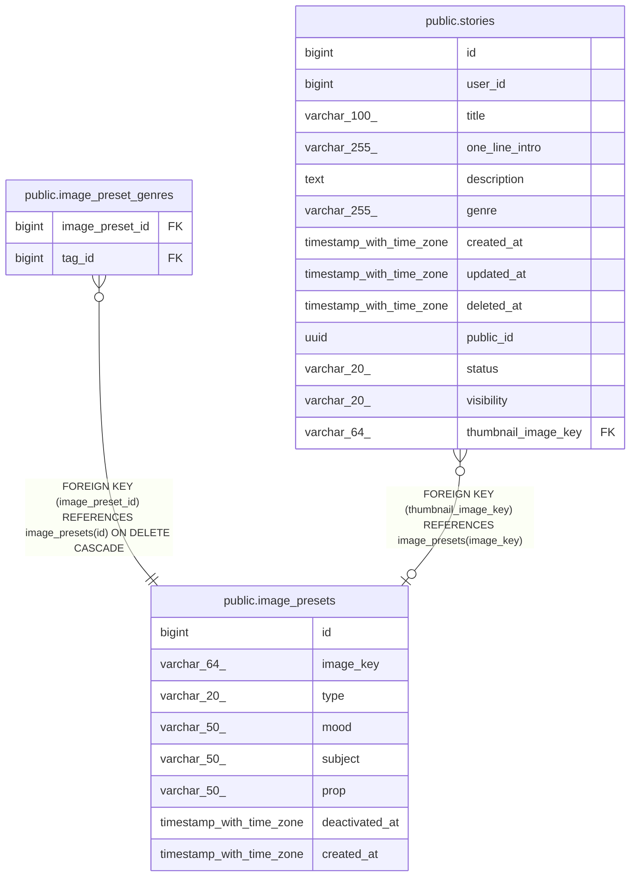

# public.image_presets

## Columns

| Name | Type | Default | Nullable | Children | Parents | Comment |
| ---- | ---- | ------- | -------- | -------- | ------- | ------- |
| id | bigint | nextval('image_presets_id_seq'::regclass) | false | [public.image_preset_genres](public.image_preset_genres.md) |  |  |
| image_key | varchar(64) |  | false | [public.stories](public.stories.md) |  |  |
| type | varchar(20) |  | false |  |  |  |
| mood | varchar(50) |  | true |  |  |  |
| subject | varchar(50) |  | true |  |  |  |
| prop | varchar(50) |  | true |  |  |  |
| deactivated_at | timestamp with time zone |  | true |  |  |  |
| created_at | timestamp with time zone | now() | false |  |  |  |

## Constraints

| Name | Type | Definition |
| ---- | ---- | ---------- |
| ck_image_presets_image_key_format | CHECK | CHECK (((image_key)::text ~ '^[a-z0-9_]{1,64}$'::text)) |
| ck_image_presets_type | CHECK | CHECK (((type)::text = ANY ((ARRAY['THUMBNAIL'::character varying, 'BACKGROUND'::character varying, 'CHARACTER'::character varying])::text[]))) |
| image_presets_pkey | PRIMARY KEY | PRIMARY KEY (id) |
| uq_image_presets_image_key | UNIQUE | UNIQUE (image_key) |

## Indexes

| Name | Definition |
| ---- | ---------- |
| image_presets_pkey | CREATE UNIQUE INDEX image_presets_pkey ON public.image_presets USING btree (id) |
| uq_image_presets_image_key | CREATE UNIQUE INDEX uq_image_presets_image_key ON public.image_presets USING btree (image_key) |
| idx_image_presets_type_active | CREATE INDEX idx_image_presets_type_active ON public.image_presets USING btree (type, deactivated_at) |

## Relations

---

> Generated by [tbls](https://github.com/k1LoW/tbls)
