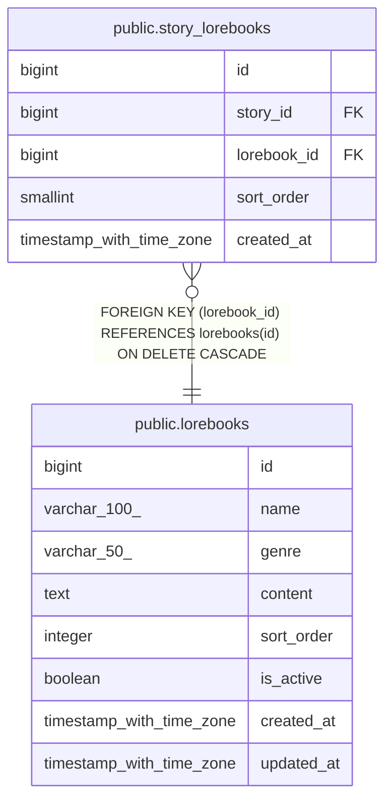

# public.lorebooks

## Columns

| Name | Type | Default | Nullable | Children | Parents | Comment |
| ---- | ---- | ------- | -------- | -------- | ------- | ------- |
| id | bigint | nextval('lorebooks_id_seq'::regclass) | false | [public.story_lorebooks](public.story_lorebooks.md) |  |  |
| name | varchar(100) |  | false |  |  |  |
| genre | varchar(50) |  | true |  |  |  |
| content | text |  | false |  |  |  |
| sort_order | integer | 0 | false |  |  |  |
| is_active | boolean | true | false |  |  |  |
| created_at | timestamp with time zone | now() | false |  |  |  |
| updated_at | timestamp with time zone | now() | false |  |  |  |

## Constraints

| Name | Type | Definition |
| ---- | ---- | ---------- |
| ck_lorebooks_sort_order | CHECK | CHECK ((sort_order >= 0)) |
| lorebooks_pkey | PRIMARY KEY | PRIMARY KEY (id) |

## Indexes

| Name | Definition |
| ---- | ---------- |
| lorebooks_pkey | CREATE UNIQUE INDEX lorebooks_pkey ON public.lorebooks USING btree (id) |
| idx_lorebooks_genre_active | CREATE INDEX idx_lorebooks_genre_active ON public.lorebooks USING btree (genre, is_active, sort_order, id) |

## Relations

---

> Generated by [tbls](https://github.com/k1LoW/tbls)
