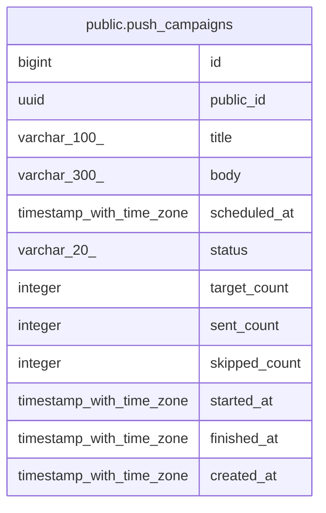

# public.push_campaigns

## Columns

| Name | Type | Default | Nullable | Children | Parents | Comment |
| ---- | ---- | ------- | -------- | -------- | ------- | ------- |
| id | bigint | nextval('push_campaigns_id_seq'::regclass) | false |  |  |  |
| public_id | uuid |  | false |  |  |  |
| title | varchar(100) |  | false |  |  |  |
| body | varchar(300) |  | false |  |  |  |
| scheduled_at | timestamp with time zone |  | false |  |  |  |
| status | varchar(20) |  | false |  |  |  |
| target_count | integer |  | true |  |  |  |
| sent_count | integer |  | true |  |  |  |
| skipped_count | integer |  | true |  |  |  |
| started_at | timestamp with time zone |  | true |  |  |  |
| finished_at | timestamp with time zone |  | true |  |  |  |
| created_at | timestamp with time zone | now() | false |  |  |  |

## Constraints

| Name | Type | Definition |
| ---- | ---- | ---------- |
| ck_push_campaigns_status | CHECK | CHECK (((status)::text = ANY ((ARRAY['SCHEDULED'::character varying, 'SENDING'::character varying, 'SENT'::character varying, 'CANCELED'::character varying, 'FAILED'::character varying])::text[]))) |
| push_campaigns_pkey | PRIMARY KEY | PRIMARY KEY (id) |
| push_campaigns_public_id_key | UNIQUE | UNIQUE (public_id) |

## Indexes

| Name | Definition |
| ---- | ---------- |
| push_campaigns_pkey | CREATE UNIQUE INDEX push_campaigns_pkey ON public.push_campaigns USING btree (id) |
| push_campaigns_public_id_key | CREATE UNIQUE INDEX push_campaigns_public_id_key ON public.push_campaigns USING btree (public_id) |
| idx_push_campaigns_status_scheduled_at | CREATE INDEX idx_push_campaigns_status_scheduled_at ON public.push_campaigns USING btree (status, scheduled_at) |

## Relations

---

> Generated by [tbls](https://github.com/k1LoW/tbls)
