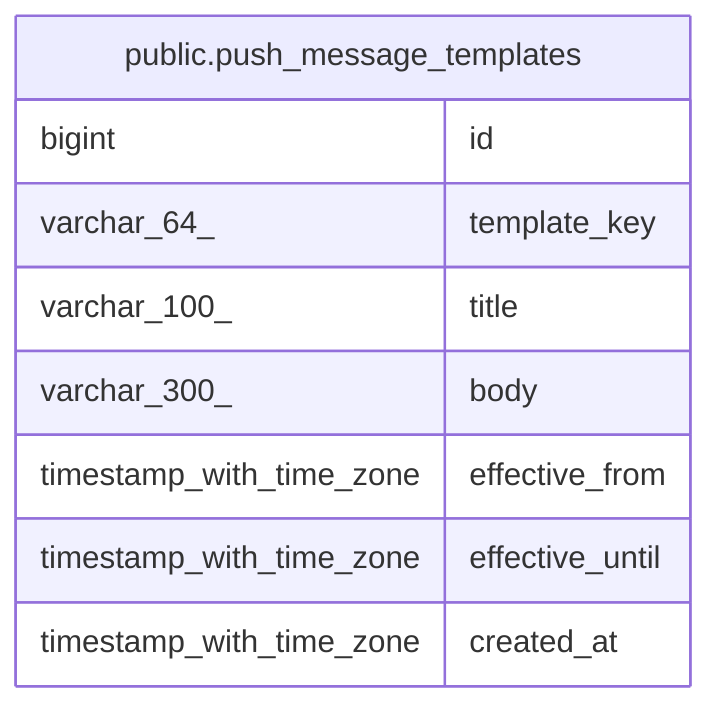

# public.push_message_templates

## Columns

| Name | Type | Default | Nullable | Children | Parents | Comment |
| ---- | ---- | ------- | -------- | -------- | ------- | ------- |
| id | bigint | nextval('push_message_templates_id_seq'::regclass) | false |  |  |  |
| template_key | varchar(64) |  | false |  |  |  |
| title | varchar(100) |  | false |  |  |  |
| body | varchar(300) |  | false |  |  |  |
| effective_from | timestamp with time zone | now() | false |  |  |  |
| effective_until | timestamp with time zone |  | true |  |  |  |
| created_at | timestamp with time zone | now() | false |  |  |  |

## Constraints

| Name | Type | Definition |
| ---- | ---- | ---------- |
| push_message_templates_pkey | PRIMARY KEY | PRIMARY KEY (id) |

## Indexes

| Name | Definition |
| ---- | ---------- |
| push_message_templates_pkey | CREATE UNIQUE INDEX push_message_templates_pkey ON public.push_message_templates USING btree (id) |
| idx_push_message_templates_key | CREATE INDEX idx_push_message_templates_key ON public.push_message_templates USING btree (template_key) |

## Relations

---

> Generated by [tbls](https://github.com/k1LoW/tbls)
