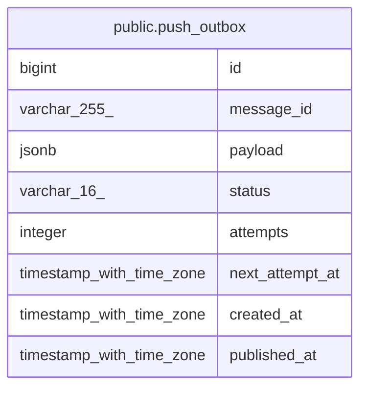

# public.push_outbox

## Columns

| Name | Type | Default | Nullable | Children | Parents | Comment |
| ---- | ---- | ------- | -------- | -------- | ------- | ------- |
| id | bigint |  | false |  |  |  |
| message_id | varchar(255) |  | false |  |  |  |
| payload | jsonb |  | false |  |  |  |
| status | varchar(16) | 'PENDING'::character varying | false |  |  |  |
| attempts | integer | 0 | false |  |  |  |
| next_attempt_at | timestamp with time zone |  | false |  |  |  |
| created_at | timestamp with time zone |  | false |  |  |  |
| published_at | timestamp with time zone |  | true |  |  |  |

## Constraints

| Name | Type | Definition |
| ---- | ---- | ---------- |
| push_outbox_status_check | CHECK | CHECK (((status)::text = ANY ((ARRAY['PENDING'::character varying, 'PUBLISHED'::character varying, 'FAILED'::character varying])::text[]))) |
| push_outbox_pkey | PRIMARY KEY | PRIMARY KEY (id) |
| push_outbox_message_id_key | UNIQUE | UNIQUE (message_id) |

## Indexes

| Name | Definition |
| ---- | ---------- |
| push_outbox_pkey | CREATE UNIQUE INDEX push_outbox_pkey ON public.push_outbox USING btree (id) |
| push_outbox_message_id_key | CREATE UNIQUE INDEX push_outbox_message_id_key ON public.push_outbox USING btree (message_id) |
| idx_push_outbox_pending | CREATE INDEX idx_push_outbox_pending ON public.push_outbox USING btree (next_attempt_at) WHERE ((status)::text = 'PENDING'::text) |

## Relations

---

> Generated by [tbls](https://github.com/k1LoW/tbls)
