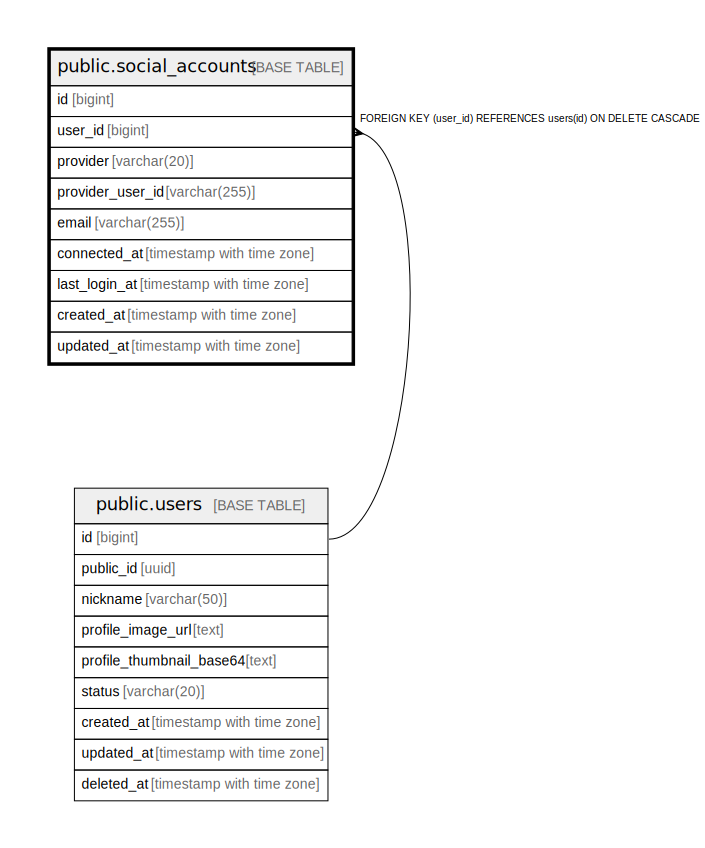

# public.social_accounts

## Columns

| Name | Type | Default | Nullable | Children | Parents | Comment |
| ---- | ---- | ------- | -------- | -------- | ------- | ------- |
| id | bigint | nextval('social_accounts_id_seq'::regclass) | false |  |  |  |
| user_id | bigint |  | false |  | [public.users](public.users.md) |  |
| provider | varchar(20) |  | false |  |  |  |
| provider_user_id | varchar(255) |  | false |  |  |  |
| email | varchar(255) |  | true |  |  |  |
| connected_at | timestamp with time zone | now() | false |  |  |  |
| last_login_at | timestamp with time zone |  | true |  |  |  |
| created_at | timestamp with time zone | now() | false |  |  |  |
| updated_at | timestamp with time zone | now() | false |  |  |  |

## Constraints

| Name | Type | Definition |
| ---- | ---- | ---------- |
| ck_social_accounts_provider | CHECK | CHECK (((provider)::text = ANY ((ARRAY['GOOGLE'::character varying, 'KAKAO'::character varying, 'APPLE'::character varying, 'NAVER'::character varying])::text[]))) |
| social_accounts_user_id_fkey | FOREIGN KEY | FOREIGN KEY (user_id) REFERENCES users(id) ON DELETE CASCADE |
| social_accounts_pkey | PRIMARY KEY | PRIMARY KEY (id) |
| uq_social_accounts_provider_user | UNIQUE | UNIQUE (provider, provider_user_id) |

## Indexes

| Name | Definition |
| ---- | ---------- |
| social_accounts_pkey | CREATE UNIQUE INDEX social_accounts_pkey ON public.social_accounts USING btree (id) |
| uq_social_accounts_provider_user | CREATE UNIQUE INDEX uq_social_accounts_provider_user ON public.social_accounts USING btree (provider, provider_user_id) |
| idx_social_accounts_user | CREATE INDEX idx_social_accounts_user ON public.social_accounts USING btree (user_id) |

## Relations

---

> Generated by [tbls](https://github.com/k1LoW/tbls)
