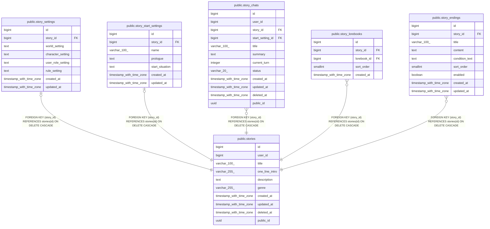

# public.stories

## Columns

| Name | Type | Default | Nullable | Children | Parents | Comment |
| ---- | ---- | ------- | -------- | -------- | ------- | ------- |
| id | bigint | nextval('stories_id_seq'::regclass) | false | [public.story_settings](public.story_settings.md) [public.story_start_settings](public.story_start_settings.md) [public.story_chats](public.story_chats.md) [public.story_lorebooks](public.story_lorebooks.md) [public.story_endings](public.story_endings.md) |  |  |
| user_id | bigint |  | true |  |  |  |
| title | varchar(100) |  | false |  |  |  |
| one_line_intro | varchar(255) |  | true |  |  |  |
| description | text |  | true |  |  |  |
| genre | varchar(255) |  | true |  |  |  |
| created_at | timestamp with time zone | now() | false |  |  |  |
| updated_at | timestamp with time zone | now() | false |  |  |  |
| deleted_at | timestamp with time zone |  | true |  |  |  |
| public_id | uuid | gen_random_uuid() | false |  |  |  |

## Constraints

| Name | Type | Definition |
| ---- | ---- | ---------- |
| stories_pkey | PRIMARY KEY | PRIMARY KEY (id) |
| uq_stories_public_id | UNIQUE | UNIQUE (public_id) |

## Indexes

| Name | Definition |
| ---- | ---------- |
| stories_pkey | CREATE UNIQUE INDEX stories_pkey ON public.stories USING btree (id) |
| uq_stories_public_id | CREATE UNIQUE INDEX uq_stories_public_id ON public.stories USING btree (public_id) |

## Relations

---

> Generated by [tbls](https://github.com/k1LoW/tbls)
