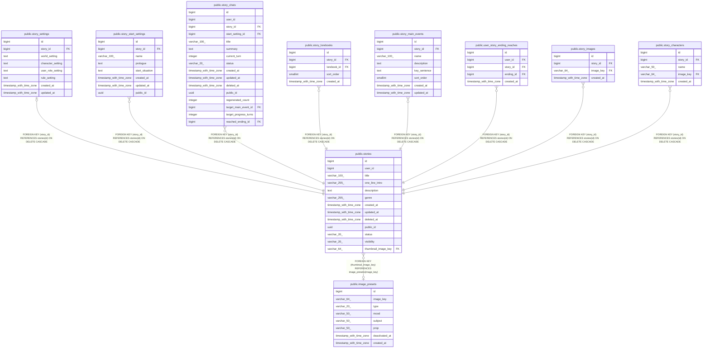

# public.stories

## Columns

| Name | Type | Default | Nullable | Children | Parents | Comment |
| ---- | ---- | ------- | -------- | -------- | ------- | ------- |
| id | bigint | nextval('stories_id_seq'::regclass) | false | [public.story_settings](public.story_settings.md) [public.story_start_settings](public.story_start_settings.md) [public.story_chats](public.story_chats.md) [public.story_lorebooks](public.story_lorebooks.md) [public.story_main_events](public.story_main_events.md) [public.user_story_ending_reaches](public.user_story_ending_reaches.md) [public.story_images](public.story_images.md) [public.story_characters](public.story_characters.md) |  |  |
| user_id | bigint |  | true |  |  |  |
| title | varchar(100) |  | false |  |  |  |
| one_line_intro | varchar(255) |  | true |  |  |  |
| description | text |  | true |  |  |  |
| genre | varchar(255) |  | true |  |  |  |
| created_at | timestamp with time zone | now() | false |  |  |  |
| updated_at | timestamp with time zone | now() | false |  |  |  |
| deleted_at | timestamp with time zone |  | true |  |  |  |
| public_id | uuid | gen_random_uuid() | false |  |  |  |
| status | varchar(20) | 'PUBLISHED'::character varying | false |  |  |  |
| visibility | varchar(20) | 'PUBLIC'::character varying | false |  |  |  |
| thumbnail_image_key | varchar(64) |  | true |  | [public.image_presets](public.image_presets.md) |  |

## Constraints

| Name | Type | Definition |
| ---- | ---- | ---------- |
| ck_stories_status | CHECK | CHECK (((status)::text = ANY ((ARRAY['DRAFT'::character varying, 'PUBLISHED'::character varying])::text[]))) |
| ck_stories_visibility | CHECK | CHECK (((visibility)::text = ANY ((ARRAY['PUBLIC'::character varying, 'PRIVATE'::character varying])::text[]))) |
| stories_pkey | PRIMARY KEY | PRIMARY KEY (id) |
| uq_stories_public_id | UNIQUE | UNIQUE (public_id) |
| fk_stories_thumbnail_image_key | FOREIGN KEY | FOREIGN KEY (thumbnail_image_key) REFERENCES image_presets(image_key) |

## Indexes

| Name | Definition |
| ---- | ---------- |
| stories_pkey | CREATE UNIQUE INDEX stories_pkey ON public.stories USING btree (id) |
| uq_stories_public_id | CREATE UNIQUE INDEX uq_stories_public_id ON public.stories USING btree (public_id) |
| idx_stories_user_created | CREATE INDEX idx_stories_user_created ON public.stories USING btree (user_id, created_at DESC, id DESC) WHERE (deleted_at IS NULL) |

## Relations

---

> Generated by [tbls](https://github.com/k1LoW/tbls)
