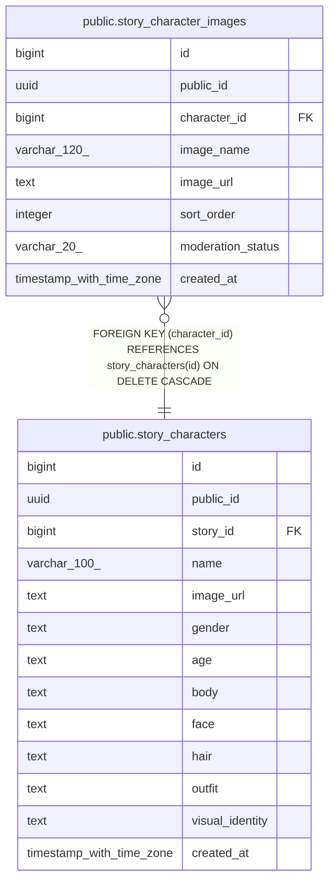

# public.story_character_images

## Columns

| Name | Type | Default | Nullable | Children | Parents | Comment |
| ---- | ---- | ------- | -------- | -------- | ------- | ------- |
| id | bigint | nextval('story_character_images_id_seq'::regclass) | false |  |  |  |
| public_id | uuid |  | false |  |  |  |
| character_id | bigint |  | false |  | [public.story_characters](public.story_characters.md) |  |
| image_name | varchar(120) |  | false |  |  |  |
| image_url | text |  | false |  |  |  |
| sort_order | integer | 0 | false |  |  |  |
| moderation_status | varchar(20) | 'APPROVED'::character varying | false |  |  |  |
| created_at | timestamp with time zone | now() | false |  |  |  |

## Constraints

| Name | Type | Definition |
| ---- | ---- | ---------- |
| ck_story_character_images_moderation | CHECK | CHECK (((moderation_status)::text = ANY ((ARRAY['APPROVED'::character varying, 'PENDING'::character varying, 'REJECTED'::character varying])::text[]))) |
| story_character_images_character_id_fkey | FOREIGN KEY | FOREIGN KEY (character_id) REFERENCES story_characters(id) ON DELETE CASCADE |
| story_character_images_pkey | PRIMARY KEY | PRIMARY KEY (id) |
| story_character_images_public_id_key | UNIQUE | UNIQUE (public_id) |
| uq_story_character_images_name | UNIQUE | UNIQUE (character_id, image_name) |

## Indexes

| Name | Definition |
| ---- | ---------- |
| story_character_images_pkey | CREATE UNIQUE INDEX story_character_images_pkey ON public.story_character_images USING btree (id) |
| story_character_images_public_id_key | CREATE UNIQUE INDEX story_character_images_public_id_key ON public.story_character_images USING btree (public_id) |
| uq_story_character_images_name | CREATE UNIQUE INDEX uq_story_character_images_name ON public.story_character_images USING btree (character_id, image_name) |
| idx_story_character_images_character | CREATE INDEX idx_story_character_images_character ON public.story_character_images USING btree (character_id) |

## Relations

---

> Generated by [tbls](https://github.com/k1LoW/tbls)
