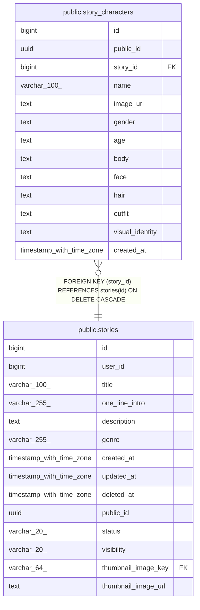

# public.story_characters

## Columns

| Name | Type | Default | Nullable | Children | Parents | Comment |
| ---- | ---- | ------- | -------- | -------- | ------- | ------- |
| id | bigint | nextval('story_characters_id_seq'::regclass) | false |  |  |  |
| public_id | uuid |  | false |  |  |  |
| story_id | bigint |  | false |  | [public.stories](public.stories.md) |  |
| name | varchar(100) |  | false |  |  |  |
| image_url | text |  | true |  |  |  |
| gender | text |  | true |  |  |  |
| age | text |  | true |  |  |  |
| body | text |  | true |  |  |  |
| face | text |  | true |  |  |  |
| hair | text |  | true |  |  |  |
| outfit | text |  | true |  |  |  |
| visual_identity | text |  | true |  |  |  |
| created_at | timestamp with time zone | now() | false |  |  |  |

## Constraints

| Name | Type | Definition |
| ---- | ---- | ---------- |
| story_characters_story_id_fkey | FOREIGN KEY | FOREIGN KEY (story_id) REFERENCES stories(id) ON DELETE CASCADE |
| story_characters_pkey | PRIMARY KEY | PRIMARY KEY (id) |
| story_characters_public_id_key | UNIQUE | UNIQUE (public_id) |
| uq_story_characters_name | UNIQUE | UNIQUE (story_id, name) |

## Indexes

| Name | Definition |
| ---- | ---------- |
| story_characters_pkey | CREATE UNIQUE INDEX story_characters_pkey ON public.story_characters USING btree (id) |
| story_characters_public_id_key | CREATE UNIQUE INDEX story_characters_public_id_key ON public.story_characters USING btree (public_id) |
| uq_story_characters_name | CREATE UNIQUE INDEX uq_story_characters_name ON public.story_characters USING btree (story_id, name) |

## Relations

```mermaid
erDiagram

"public.story_characters" }o--|| "public.stories" : "FOREIGN KEY (story_id) REFERENCES stories(id) ON DELETE CASCADE"

"public.story_characters" {
  bigint id
  uuid public_id
  bigint story_id FK
  varchar_100_ name
  text image_url
  text gender
  text age
  text body
  text face
  text hair
  text outfit
  text visual_identity
  timestamp_with_time_zone created_at
}
"public.stories" {
  bigint id
  bigint user_id
  varchar_100_ title
  varchar_255_ one_line_intro
  text description
  varchar_255_ genre
  timestamp_with_time_zone created_at
  timestamp_with_time_zone updated_at
  timestamp_with_time_zone deleted_at
  uuid public_id
  varchar_20_ status
  varchar_20_ visibility
  varchar_64_ thumbnail_image_key FK
  text thumbnail_image_url
}
```

---

> Generated by [tbls](https://github.com/k1LoW/tbls)
