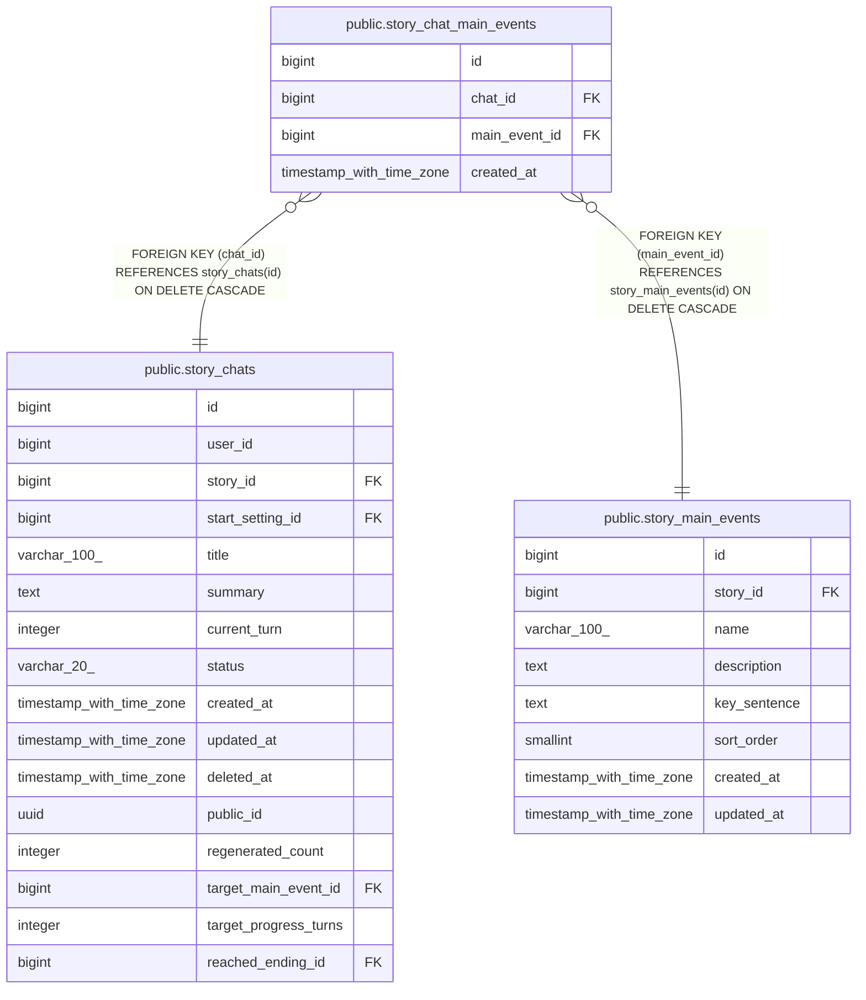

# public.story_chat_main_events

## Columns

| Name | Type | Default | Nullable | Children | Parents | Comment |
| ---- | ---- | ------- | -------- | -------- | ------- | ------- |
| id | bigint | nextval('story_chat_main_events_id_seq'::regclass) | false |  |  |  |
| chat_id | bigint |  | false |  | [public.story_chats](public.story_chats.md) |  |
| main_event_id | bigint |  | false |  | [public.story_main_events](public.story_main_events.md) |  |
| created_at | timestamp with time zone | now() | false |  |  |  |

## Constraints

| Name | Type | Definition |
| ---- | ---- | ---------- |
| fk_story_chat_main_events_chat | FOREIGN KEY | FOREIGN KEY (chat_id) REFERENCES story_chats(id) ON DELETE CASCADE |
| fk_story_chat_main_events_main_event | FOREIGN KEY | FOREIGN KEY (main_event_id) REFERENCES story_main_events(id) ON DELETE CASCADE |
| story_chat_main_events_pkey | PRIMARY KEY | PRIMARY KEY (id) |
| uq_story_chat_main_events | UNIQUE | UNIQUE (chat_id, main_event_id) |

## Indexes

| Name | Definition |
| ---- | ---------- |
| story_chat_main_events_pkey | CREATE UNIQUE INDEX story_chat_main_events_pkey ON public.story_chat_main_events USING btree (id) |
| uq_story_chat_main_events | CREATE UNIQUE INDEX uq_story_chat_main_events ON public.story_chat_main_events USING btree (chat_id, main_event_id) |
| idx_story_chat_main_events_chat | CREATE INDEX idx_story_chat_main_events_chat ON public.story_chat_main_events USING btree (chat_id) |

## Relations

---

> Generated by [tbls](https://github.com/k1LoW/tbls)
