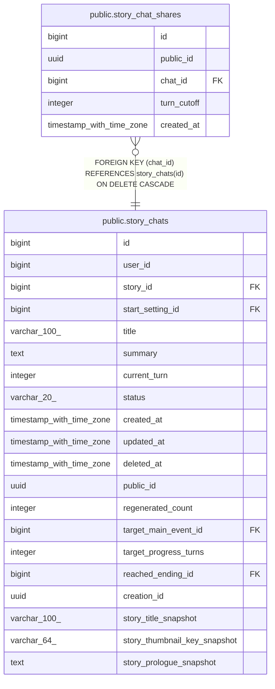

# public.story_chat_shares

## Columns

| Name | Type | Default | Nullable | Children | Parents | Comment |
| ---- | ---- | ------- | -------- | -------- | ------- | ------- |
| id | bigint | nextval('story_chat_shares_id_seq'::regclass) | false |  |  |  |
| public_id | uuid |  | false |  |  |  |
| chat_id | bigint |  | false |  | [public.story_chats](public.story_chats.md) |  |
| turn_cutoff | integer |  | false |  |  |  |
| created_at | timestamp with time zone | now() | false |  |  |  |

## Constraints

| Name | Type | Definition |
| ---- | ---- | ---------- |
| fk_story_chat_shares_chat | FOREIGN KEY | FOREIGN KEY (chat_id) REFERENCES story_chats(id) ON DELETE CASCADE |
| story_chat_shares_pkey | PRIMARY KEY | PRIMARY KEY (id) |
| uq_story_chat_shares_public_id | UNIQUE | UNIQUE (public_id) |
| uq_story_chat_shares_chat_cutoff | UNIQUE | UNIQUE (chat_id, turn_cutoff) |

## Indexes

| Name | Definition |
| ---- | ---------- |
| story_chat_shares_pkey | CREATE UNIQUE INDEX story_chat_shares_pkey ON public.story_chat_shares USING btree (id) |
| uq_story_chat_shares_public_id | CREATE UNIQUE INDEX uq_story_chat_shares_public_id ON public.story_chat_shares USING btree (public_id) |
| uq_story_chat_shares_chat_cutoff | CREATE UNIQUE INDEX uq_story_chat_shares_chat_cutoff ON public.story_chat_shares USING btree (chat_id, turn_cutoff) |

## Relations

---

> Generated by [tbls](https://github.com/k1LoW/tbls)
