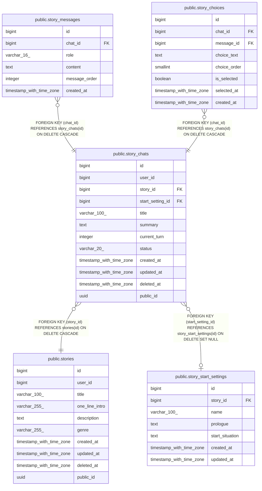

# public.story_chats

## Columns

| Name | Type | Default | Nullable | Children | Parents | Comment |
| ---- | ---- | ------- | -------- | -------- | ------- | ------- |
| id | bigint | nextval('story_chats_id_seq'::regclass) | false | [public.story_messages](public.story_messages.md) [public.story_choices](public.story_choices.md) |  |  |
| user_id | bigint |  | true |  |  |  |
| story_id | bigint |  | false |  | [public.stories](public.stories.md) |  |
| start_setting_id | bigint |  | true |  | [public.story_start_settings](public.story_start_settings.md) |  |
| title | varchar(100) |  | true |  |  |  |
| summary | text |  | true |  |  |  |
| current_turn | integer | 0 | false |  |  |  |
| status | varchar(20) | 'ACTIVE'::character varying | false |  |  |  |
| created_at | timestamp with time zone | now() | false |  |  |  |
| updated_at | timestamp with time zone | now() | false |  |  |  |
| deleted_at | timestamp with time zone |  | true |  |  |  |
| public_id | uuid | gen_random_uuid() | false |  |  |  |

## Constraints

| Name | Type | Definition |
| ---- | ---- | ---------- |
| ck_story_chats_current_turn | CHECK | CHECK ((current_turn >= 0)) |
| ck_story_chats_status | CHECK | CHECK (((status)::text = ANY ((ARRAY['ACTIVE'::character varying, 'ENDED'::character varying])::text[]))) |
| story_chats_story_id_fkey | FOREIGN KEY | FOREIGN KEY (story_id) REFERENCES stories(id) ON DELETE CASCADE |
| story_chats_start_setting_id_fkey | FOREIGN KEY | FOREIGN KEY (start_setting_id) REFERENCES story_start_settings(id) ON DELETE SET NULL |
| story_chats_pkey | PRIMARY KEY | PRIMARY KEY (id) |
| uq_story_chats_public_id | UNIQUE | UNIQUE (public_id) |

## Indexes

| Name | Definition |
| ---- | ---------- |
| story_chats_pkey | CREATE UNIQUE INDEX story_chats_pkey ON public.story_chats USING btree (id) |
| idx_story_chats_story | CREATE INDEX idx_story_chats_story ON public.story_chats USING btree (story_id) |
| uq_story_chats_public_id | CREATE UNIQUE INDEX uq_story_chats_public_id ON public.story_chats USING btree (public_id) |

## Relations

---

> Generated by [tbls](https://github.com/k1LoW/tbls)
