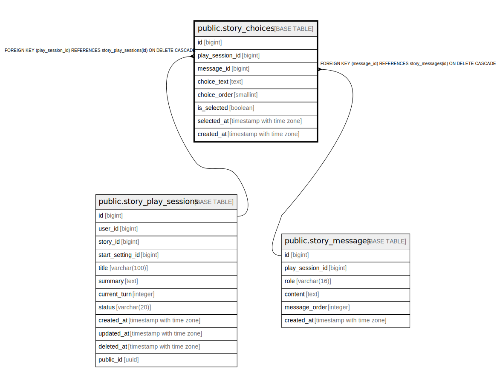

# public.story_choices

## Columns

| Name | Type | Default | Nullable | Children | Parents | Comment |
| ---- | ---- | ------- | -------- | -------- | ------- | ------- |
| id | bigint | nextval('story_choices_id_seq'::regclass) | false |  |  |  |
| play_session_id | bigint |  | false |  | [public.story_play_sessions](public.story_play_sessions.md) |  |
| message_id | bigint |  | false |  | [public.story_messages](public.story_messages.md) |  |
| choice_text | text |  | false |  |  |  |
| choice_order | smallint |  | false |  |  |  |
| is_selected | boolean | false | false |  |  |  |
| selected_at | timestamp with time zone |  | true |  |  |  |
| created_at | timestamp with time zone | now() | false |  |  |  |

## Constraints

| Name | Type | Definition |
| ---- | ---- | ---------- |
| ck_story_choices_order | CHECK | CHECK ((choice_order > 0)) |
| story_choices_play_session_id_fkey | FOREIGN KEY | FOREIGN KEY (play_session_id) REFERENCES story_play_sessions(id) ON DELETE CASCADE |
| story_choices_message_id_fkey | FOREIGN KEY | FOREIGN KEY (message_id) REFERENCES story_messages(id) ON DELETE CASCADE |
| story_choices_pkey | PRIMARY KEY | PRIMARY KEY (id) |
| uq_story_choices_order | UNIQUE | UNIQUE (message_id, choice_order) |

## Indexes

| Name | Definition |
| ---- | ---------- |
| story_choices_pkey | CREATE UNIQUE INDEX story_choices_pkey ON public.story_choices USING btree (id) |
| uq_story_choices_order | CREATE UNIQUE INDEX uq_story_choices_order ON public.story_choices USING btree (message_id, choice_order) |
| idx_story_choices_message | CREATE INDEX idx_story_choices_message ON public.story_choices USING btree (message_id) |
| idx_story_choices_play_session | CREATE INDEX idx_story_choices_play_session ON public.story_choices USING btree (play_session_id) |

## Relations

---

> Generated by [tbls](https://github.com/k1LoW/tbls)
