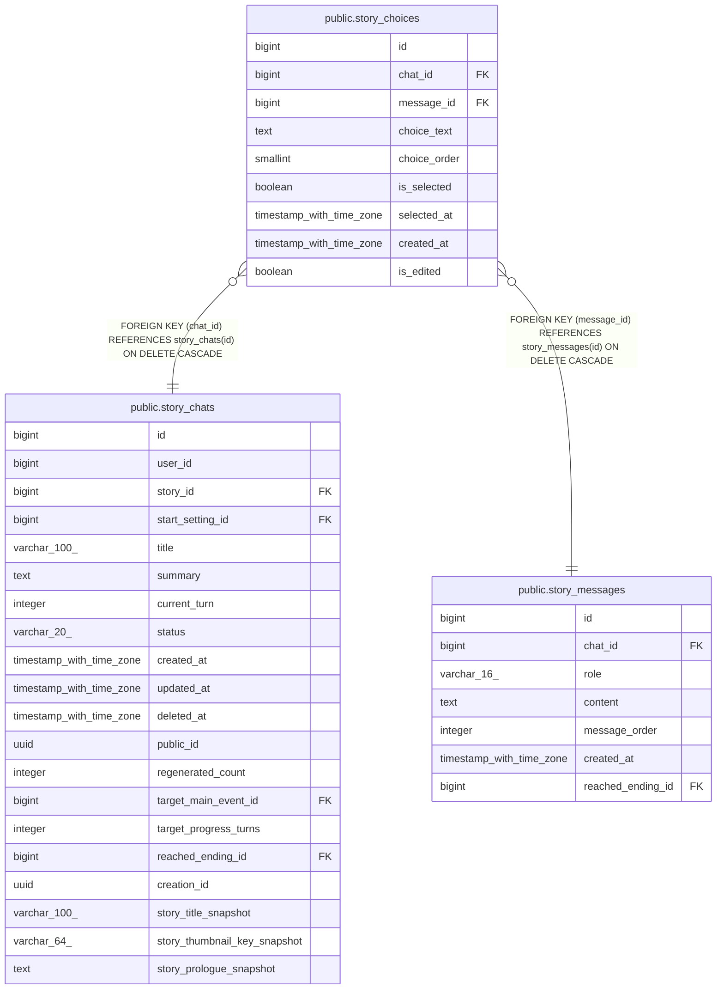

# public.story_choices

## Columns

| Name | Type | Default | Nullable | Children | Parents | Comment |
| ---- | ---- | ------- | -------- | -------- | ------- | ------- |
| id | bigint | nextval('story_choices_id_seq'::regclass) | false |  |  |  |
| chat_id | bigint |  | false |  | [public.story_chats](public.story_chats.md) |  |
| message_id | bigint |  | false |  | [public.story_messages](public.story_messages.md) |  |
| choice_text | text |  | false |  |  |  |
| choice_order | smallint |  | false |  |  |  |
| is_selected | boolean | false | false |  |  | KNK-819: 이 선택지를 골라 다음 턴을 보냈으면 true. 다음 턴 저장 트랜잭션에서 직전 턴의 해당 행에 기록한다(마지막 턴이 아니거나 순번이 범위 밖이면 기록을 건너뛴다). |
| selected_at | timestamp with time zone |  | true |  |  | KNK-819: is_selected를 true로 기록한 시각. 그 선택으로 진행한 다음 턴이 저장된 시각과 같다. |
| created_at | timestamp with time zone | now() | false |  |  |  |
| is_edited | boolean |  | true |  |  | KNK-819: 선택한 선택지 원문과 최종 user_input의 정규화(NFC→trim→내부 공백 런 축약, 구두점 보존) 비교 결과. 고쳐 보냈으면 true, 그대로면 false. 선택 기록이 없으면 NULL. |

## Constraints

| Name | Type | Definition |
| ---- | ---- | ---------- |
| ck_story_choices_order | CHECK | CHECK ((choice_order > 0)) |
| story_choices_chat_id_fkey | FOREIGN KEY | FOREIGN KEY (chat_id) REFERENCES story_chats(id) ON DELETE CASCADE |
| story_choices_message_id_fkey | FOREIGN KEY | FOREIGN KEY (message_id) REFERENCES story_messages(id) ON DELETE CASCADE |
| story_choices_pkey | PRIMARY KEY | PRIMARY KEY (id) |
| uq_story_choices_order | UNIQUE | UNIQUE (message_id, choice_order) |

## Indexes

| Name | Definition |
| ---- | ---------- |
| story_choices_pkey | CREATE UNIQUE INDEX story_choices_pkey ON public.story_choices USING btree (id) |
| uq_story_choices_order | CREATE UNIQUE INDEX uq_story_choices_order ON public.story_choices USING btree (message_id, choice_order) |
| idx_story_choices_message | CREATE INDEX idx_story_choices_message ON public.story_choices USING btree (message_id) |
| idx_story_choices_chat | CREATE INDEX idx_story_choices_chat ON public.story_choices USING btree (chat_id) |

## Relations

```mermaid
erDiagram

"public.story_choices" }o--|| "public.story_chats" : "FOREIGN KEY (chat_id) REFERENCES story_chats(id) ON DELETE CASCADE"
"public.story_choices" }o--|| "public.story_messages" : "FOREIGN KEY (message_id) REFERENCES story_messages(id) ON DELETE CASCADE"

"public.story_choices" {
  bigint id
  bigint chat_id FK
  bigint message_id FK
  text choice_text
  smallint choice_order
  boolean is_selected
  timestamp_with_time_zone selected_at
  timestamp_with_time_zone created_at
  boolean is_edited
}
"public.story_chats" {
  bigint id
  bigint user_id
  bigint story_id FK
  bigint start_setting_id FK
  varchar_100_ title
  text summary
  integer current_turn
  varchar_20_ status
  timestamp_with_time_zone created_at
  timestamp_with_time_zone updated_at
  timestamp_with_time_zone deleted_at
  uuid public_id
  integer regenerated_count
  bigint target_main_event_id FK
  integer target_progress_turns
  bigint reached_ending_id FK
  uuid creation_id
  varchar_100_ story_title_snapshot
  varchar_64_ story_thumbnail_key_snapshot
  text story_prologue_snapshot
}
"public.story_messages" {
  bigint id
  bigint chat_id FK
  varchar_16_ role
  text content
  integer message_order
  timestamp_with_time_zone created_at
  bigint reached_ending_id FK
}
```

---

> Generated by [tbls](https://github.com/k1LoW/tbls)
