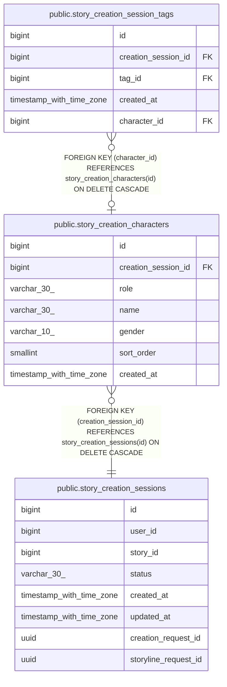

# public.story_creation_characters

## Columns

| Name | Type | Default | Nullable | Children | Parents | Comment |
| ---- | ---- | ------- | -------- | -------- | ------- | ------- |
| id | bigint | nextval('story_creation_characters_id_seq'::regclass) | false | [public.story_creation_session_tags](public.story_creation_session_tags.md) |  |  |
| creation_session_id | bigint |  | false |  | [public.story_creation_sessions](public.story_creation_sessions.md) |  |
| role | varchar(30) |  | false |  |  |  |
| name | varchar(30) |  | true |  |  |  |
| gender | varchar(10) |  | true |  |  |  |
| sort_order | smallint |  | false |  |  |  |
| created_at | timestamp with time zone | now() | false |  |  |  |

## Constraints

| Name | Type | Definition |
| ---- | ---- | ---------- |
| ck_story_creation_characters_gender | CHECK | CHECK (((gender IS NULL) OR ((gender)::text = ANY ((ARRAY['MALE'::character varying, 'FEMALE'::character varying])::text[])))) |
| ck_story_creation_characters_protagonist_order | CHECK | CHECK ((((role)::text <> 'PROTAGONIST'::text) OR (sort_order = 1))) |
| ck_story_creation_characters_role | CHECK | CHECK (((role)::text = ANY ((ARRAY['PROTAGONIST'::character varying, 'SUPPORTING_CHARACTER'::character varying])::text[]))) |
| ck_story_creation_characters_sort_order | CHECK | CHECK ((sort_order > 0)) |
| story_creation_characters_creation_session_id_fkey | FOREIGN KEY | FOREIGN KEY (creation_session_id) REFERENCES story_creation_sessions(id) ON DELETE CASCADE |
| story_creation_characters_pkey | PRIMARY KEY | PRIMARY KEY (id) |
| uq_story_creation_characters_role_order | UNIQUE | UNIQUE (creation_session_id, role, sort_order) |

## Indexes

| Name | Definition |
| ---- | ---------- |
| story_creation_characters_pkey | CREATE UNIQUE INDEX story_creation_characters_pkey ON public.story_creation_characters USING btree (id) |
| uq_story_creation_characters_role_order | CREATE UNIQUE INDEX uq_story_creation_characters_role_order ON public.story_creation_characters USING btree (creation_session_id, role, sort_order) |
| uq_story_creation_characters_protagonist | CREATE UNIQUE INDEX uq_story_creation_characters_protagonist ON public.story_creation_characters USING btree (creation_session_id) WHERE ((role)::text = 'PROTAGONIST'::text) |

## Relations

---

> Generated by [tbls](https://github.com/k1LoW/tbls)
