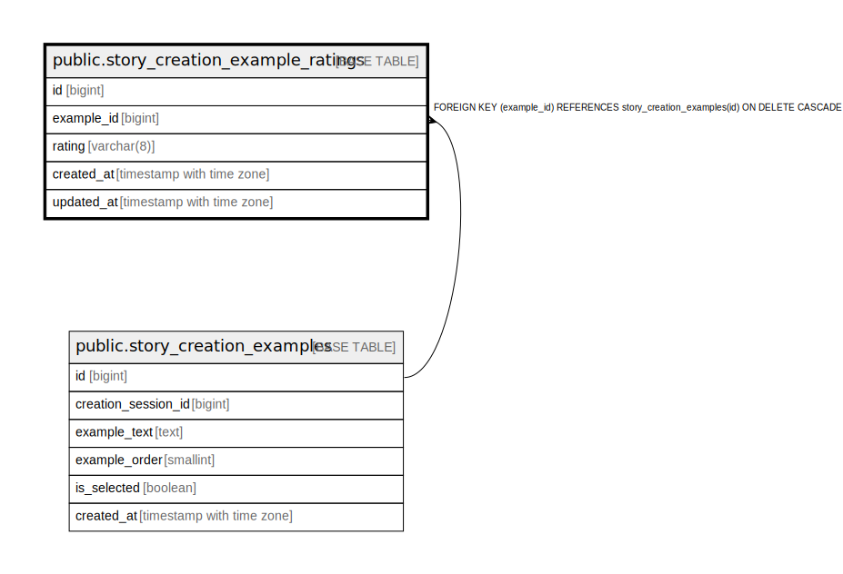

# public.story_creation_example_ratings

## Columns

| Name | Type | Default | Nullable | Children | Parents | Comment |
| ---- | ---- | ------- | -------- | -------- | ------- | ------- |
| id | bigint | nextval('story_creation_example_ratings_id_seq'::regclass) | false |  |  |  |
| example_id | bigint |  | false |  | [public.story_creation_examples](public.story_creation_examples.md) |  |
| rating | varchar(8) |  | false |  |  |  |
| created_at | timestamp with time zone | now() | false |  |  |  |
| updated_at | timestamp with time zone | now() | false |  |  |  |

## Constraints

| Name | Type | Definition |
| ---- | ---- | ---------- |
| ck_story_creation_example_ratings_rating | CHECK | CHECK (((rating)::text = ANY ((ARRAY['GOOD'::character varying, 'BAD'::character varying])::text[]))) |
| story_creation_example_ratings_example_id_fkey | FOREIGN KEY | FOREIGN KEY (example_id) REFERENCES story_creation_examples(id) ON DELETE CASCADE |
| story_creation_example_ratings_pkey | PRIMARY KEY | PRIMARY KEY (id) |
| uq_story_creation_example_ratings_example | UNIQUE | UNIQUE (example_id) |

## Indexes

| Name | Definition |
| ---- | ---------- |
| story_creation_example_ratings_pkey | CREATE UNIQUE INDEX story_creation_example_ratings_pkey ON public.story_creation_example_ratings USING btree (id) |
| uq_story_creation_example_ratings_example | CREATE UNIQUE INDEX uq_story_creation_example_ratings_example ON public.story_creation_example_ratings USING btree (example_id) |

## Relations

---

> Generated by [tbls](https://github.com/k1LoW/tbls)
