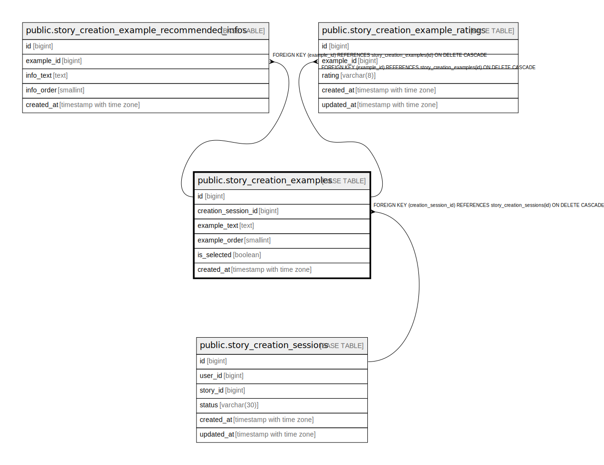

# public.story_creation_examples

## Columns

| Name | Type | Default | Nullable | Children | Parents | Comment |
| ---- | ---- | ------- | -------- | -------- | ------- | ------- |
| id | bigint | nextval('story_creation_examples_id_seq'::regclass) | false | [public.story_creation_example_recommended_infos](public.story_creation_example_recommended_infos.md) [public.story_creation_example_ratings](public.story_creation_example_ratings.md) |  |  |
| creation_session_id | bigint |  | false |  | [public.story_creation_sessions](public.story_creation_sessions.md) |  |
| example_text | text |  | false |  |  |  |
| example_order | smallint |  | false |  |  |  |
| is_selected | boolean | false | false |  |  |  |
| created_at | timestamp with time zone | now() | false |  |  |  |

## Constraints

| Name | Type | Definition |
| ---- | ---- | ---------- |
| ck_story_creation_examples_order | CHECK | CHECK ((example_order > 0)) |
| story_creation_examples_creation_session_id_fkey | FOREIGN KEY | FOREIGN KEY (creation_session_id) REFERENCES story_creation_sessions(id) ON DELETE CASCADE |
| story_creation_examples_pkey | PRIMARY KEY | PRIMARY KEY (id) |
| uq_story_creation_examples_order | UNIQUE | UNIQUE (creation_session_id, example_order) |

## Indexes

| Name | Definition |
| ---- | ---------- |
| story_creation_examples_pkey | CREATE UNIQUE INDEX story_creation_examples_pkey ON public.story_creation_examples USING btree (id) |
| uq_story_creation_examples_order | CREATE UNIQUE INDEX uq_story_creation_examples_order ON public.story_creation_examples USING btree (creation_session_id, example_order) |

## Relations

---

> Generated by [tbls](https://github.com/k1LoW/tbls)
