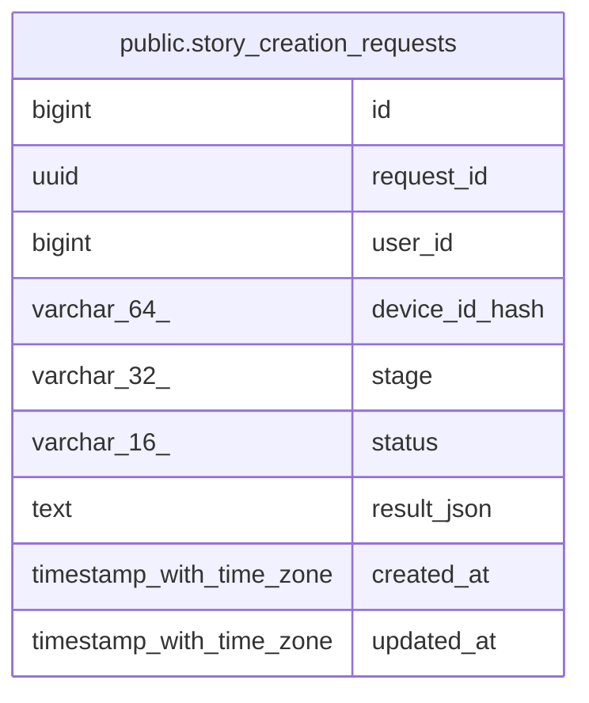

# public.story_creation_requests

## Columns

| Name | Type | Default | Nullable | Children | Parents | Comment |
| ---- | ---- | ------- | -------- | -------- | ------- | ------- |
| id | bigint | nextval('story_creation_requests_id_seq'::regclass) | false |  |  |  |
| request_id | uuid |  | false |  |  |  |
| user_id | bigint |  | true |  |  |  |
| device_id_hash | varchar(64) |  | true |  |  |  |
| stage | varchar(32) |  | false |  |  |  |
| status | varchar(16) |  | false |  |  |  |
| result_json | text |  | true |  |  |  |
| created_at | timestamp with time zone | now() | false |  |  |  |
| updated_at | timestamp with time zone | now() | false |  |  |  |

## Constraints

| Name | Type | Definition |
| ---- | ---- | ---------- |
| ck_story_creation_requests_stage | CHECK | CHECK (((stage)::text = ANY ((ARRAY['STORYLINE_GENERATION'::character varying, 'STORY_COMPLETION'::character varying])::text[]))) |
| ck_story_creation_requests_status | CHECK | CHECK (((status)::text = ANY ((ARRAY['PENDING'::character varying, 'COMPLETED'::character varying, 'FAILED'::character varying])::text[]))) |
| story_creation_requests_pkey | PRIMARY KEY | PRIMARY KEY (id) |
| uq_story_creation_requests_request_id | UNIQUE | UNIQUE (request_id) |

## Indexes

| Name | Definition |
| ---- | ---------- |
| story_creation_requests_pkey | CREATE UNIQUE INDEX story_creation_requests_pkey ON public.story_creation_requests USING btree (id) |
| uq_story_creation_requests_request_id | CREATE UNIQUE INDEX uq_story_creation_requests_request_id ON public.story_creation_requests USING btree (request_id) |

## Relations

---

> Generated by [tbls](https://github.com/k1LoW/tbls)
