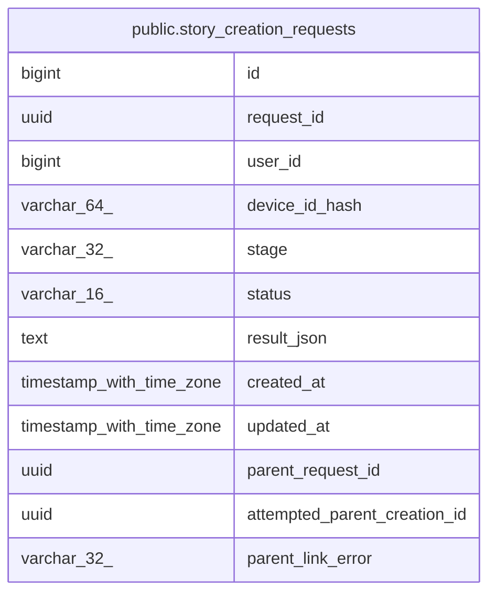

# public.story_creation_requests

## Columns

| Name | Type | Default | Nullable | Children | Parents | Comment |
| ---- | ---- | ------- | -------- | -------- | ------- | ------- |
| id | bigint | nextval('story_creation_requests_id_seq'::regclass) | false |  |  |  |
| request_id | uuid |  | false |  |  |  |
| user_id | bigint |  | true |  |  |  |
| device_id_hash | varchar(64) |  | true |  |  |  |
| stage | varchar(32) |  | false |  |  |  |
| status | varchar(16) |  | false |  |  |  |
| result_json | text |  | true |  |  |  |
| created_at | timestamp with time zone | now() | false |  |  |  |
| updated_at | timestamp with time zone | now() | false |  |  |  |
| parent_request_id | uuid |  | true |  |  | KNK-755: 검증(존재·자기참조 아님·소유 연속성)을 통과한 직전 생성의 request_id. 이 값만 X-Manyak-Parent-Creation-Id 헤더로 나간다. 최초 생성이거나 검증 실패면 NULL. |
| attempted_parent_creation_id | uuid |  | true |  |  | KNK-755: 프론트가 보낸 parentCreationId 원값. 검증 통과 여부와 무관하게 그대로 보존한다(안 보냈으면 NULL). 최초 생성과 연결 실패를 구분하는 근거. |
| parent_link_error | varchar(32) |  | true |  |  | KNK-755: 부모 링크 검증 실패 사유(NOT_FOUND·OWNER_MISMATCH·SELF_REFERENCE). 검증 성공이거나 애초에 부모를 안 보냈으면 NULL. |

## Constraints

| Name | Type | Definition |
| ---- | ---- | ---------- |
| ck_story_creation_requests_stage | CHECK | CHECK (((stage)::text = ANY ((ARRAY['STORYLINE_GENERATION'::character varying, 'STORY_COMPLETION'::character varying])::text[]))) |
| ck_story_creation_requests_status | CHECK | CHECK (((status)::text = ANY ((ARRAY['PENDING'::character varying, 'COMPLETED'::character varying, 'FAILED'::character varying])::text[]))) |
| story_creation_requests_pkey | PRIMARY KEY | PRIMARY KEY (id) |
| uq_story_creation_requests_request_id | UNIQUE | UNIQUE (request_id) |

## Indexes

| Name | Definition |
| ---- | ---------- |
| story_creation_requests_pkey | CREATE UNIQUE INDEX story_creation_requests_pkey ON public.story_creation_requests USING btree (id) |
| uq_story_creation_requests_request_id | CREATE UNIQUE INDEX uq_story_creation_requests_request_id ON public.story_creation_requests USING btree (request_id) |

## Relations

```mermaid
erDiagram


"public.story_creation_requests" {
  bigint id
  uuid request_id
  bigint user_id
  varchar_64_ device_id_hash
  varchar_32_ stage
  varchar_16_ status
  text result_json
  timestamp_with_time_zone created_at
  timestamp_with_time_zone updated_at
  uuid parent_request_id
  uuid attempted_parent_creation_id
  varchar_32_ parent_link_error
}
```

---

> Generated by [tbls](https://github.com/k1LoW/tbls)
