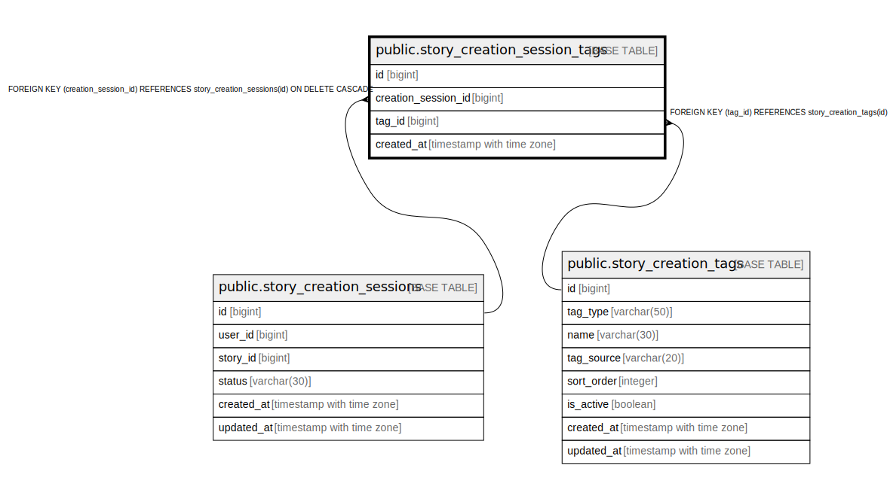

# public.story_creation_session_tags

## Columns

| Name | Type | Default | Nullable | Children | Parents | Comment |
| ---- | ---- | ------- | -------- | -------- | ------- | ------- |
| id | bigint | nextval('story_creation_session_tags_id_seq'::regclass) | false |  |  |  |
| creation_session_id | bigint |  | false |  | [public.story_creation_sessions](public.story_creation_sessions.md) |  |
| tag_id | bigint |  | false |  | [public.story_creation_tags](public.story_creation_tags.md) |  |
| created_at | timestamp with time zone | now() | false |  |  |  |

## Constraints

| Name | Type | Definition |
| ---- | ---- | ---------- |
| story_creation_session_tags_tag_id_fkey | FOREIGN KEY | FOREIGN KEY (tag_id) REFERENCES story_creation_tags(id) |
| story_creation_session_tags_creation_session_id_fkey | FOREIGN KEY | FOREIGN KEY (creation_session_id) REFERENCES story_creation_sessions(id) ON DELETE CASCADE |
| story_creation_session_tags_pkey | PRIMARY KEY | PRIMARY KEY (id) |
| uq_story_creation_session_tags_tag | UNIQUE | UNIQUE (creation_session_id, tag_id) |

## Indexes

| Name | Definition |
| ---- | ---------- |
| story_creation_session_tags_pkey | CREATE UNIQUE INDEX story_creation_session_tags_pkey ON public.story_creation_session_tags USING btree (id) |
| uq_story_creation_session_tags_tag | CREATE UNIQUE INDEX uq_story_creation_session_tags_tag ON public.story_creation_session_tags USING btree (creation_session_id, tag_id) |

## Relations

---

> Generated by [tbls](https://github.com/k1LoW/tbls)
