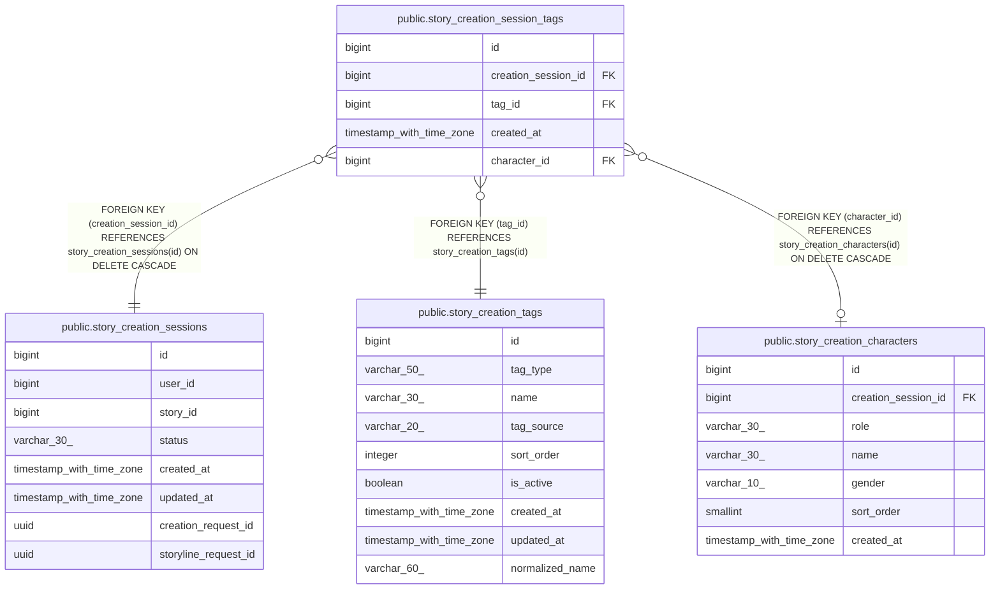

# public.story_creation_session_tags

## Columns

| Name | Type | Default | Nullable | Children | Parents | Comment |
| ---- | ---- | ------- | -------- | -------- | ------- | ------- |
| id | bigint | nextval('story_creation_session_tags_id_seq'::regclass) | false |  |  |  |
| creation_session_id | bigint |  | false |  | [public.story_creation_sessions](public.story_creation_sessions.md) |  |
| tag_id | bigint |  | false |  | [public.story_creation_tags](public.story_creation_tags.md) |  |
| created_at | timestamp with time zone | now() | false |  |  |  |
| character_id | bigint |  | true |  | [public.story_creation_characters](public.story_creation_characters.md) |  |

## Constraints

| Name | Type | Definition |
| ---- | ---- | ---------- |
| story_creation_session_tags_tag_id_fkey | FOREIGN KEY | FOREIGN KEY (tag_id) REFERENCES story_creation_tags(id) |
| story_creation_session_tags_creation_session_id_fkey | FOREIGN KEY | FOREIGN KEY (creation_session_id) REFERENCES story_creation_sessions(id) ON DELETE CASCADE |
| story_creation_session_tags_pkey | PRIMARY KEY | PRIMARY KEY (id) |
| story_creation_session_tags_character_id_fkey | FOREIGN KEY | FOREIGN KEY (character_id) REFERENCES story_creation_characters(id) ON DELETE CASCADE |
| uq_story_creation_session_tags_character_tag | UNIQUE | UNIQUE NULLS NOT DISTINCT (creation_session_id, character_id, tag_id) |

## Indexes

| Name | Definition |
| ---- | ---------- |
| story_creation_session_tags_pkey | CREATE UNIQUE INDEX story_creation_session_tags_pkey ON public.story_creation_session_tags USING btree (id) |
| uq_story_creation_session_tags_character_tag | CREATE UNIQUE INDEX uq_story_creation_session_tags_character_tag ON public.story_creation_session_tags USING btree (creation_session_id, character_id, tag_id) NULLS NOT DISTINCT |
| idx_story_creation_session_tags_character_id | CREATE INDEX idx_story_creation_session_tags_character_id ON public.story_creation_session_tags USING btree (character_id) |

## Relations

```mermaid
erDiagram

"public.story_creation_session_tags" }o--|| "public.story_creation_sessions" : "FOREIGN KEY (creation_session_id) REFERENCES story_creation_sessions(id) ON DELETE CASCADE"
"public.story_creation_session_tags" }o--|| "public.story_creation_tags" : "FOREIGN KEY (tag_id) REFERENCES story_creation_tags(id)"
"public.story_creation_session_tags" }o--o| "public.story_creation_characters" : "FOREIGN KEY (character_id) REFERENCES story_creation_characters(id) ON DELETE CASCADE"

"public.story_creation_session_tags" {
  bigint id
  bigint creation_session_id FK
  bigint tag_id FK
  timestamp_with_time_zone created_at
  bigint character_id FK
}
"public.story_creation_sessions" {
  bigint id
  bigint user_id
  bigint story_id
  varchar_30_ status
  timestamp_with_time_zone created_at
  timestamp_with_time_zone updated_at
  uuid creation_request_id
  uuid storyline_request_id
}
"public.story_creation_tags" {
  bigint id
  varchar_50_ tag_type
  varchar_30_ name
  varchar_20_ tag_source
  integer sort_order
  boolean is_active
  timestamp_with_time_zone created_at
  timestamp_with_time_zone updated_at
  varchar_60_ normalized_name
}
"public.story_creation_characters" {
  bigint id
  bigint creation_session_id FK
  varchar_30_ role
  varchar_30_ name
  varchar_10_ gender
  smallint sort_order
  timestamp_with_time_zone created_at
}
```

---

> Generated by [tbls](https://github.com/k1LoW/tbls)
