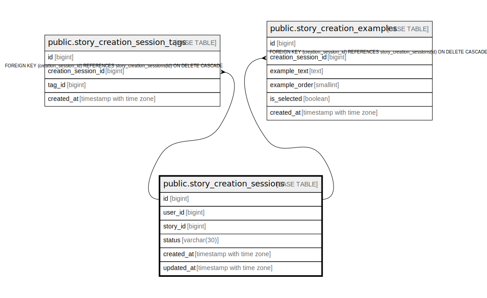

# public.story_creation_sessions

## Columns

| Name | Type | Default | Nullable | Children | Parents | Comment |
| ---- | ---- | ------- | -------- | -------- | ------- | ------- |
| id | bigint | nextval('story_creation_sessions_id_seq'::regclass) | false | [public.story_creation_session_tags](public.story_creation_session_tags.md) [public.story_creation_examples](public.story_creation_examples.md) |  |  |
| user_id | bigint |  | true |  |  |  |
| story_id | bigint |  | true |  |  |  |
| status | varchar(30) |  | false |  |  |  |
| created_at | timestamp with time zone | now() | false |  |  |  |
| updated_at | timestamp with time zone | now() | false |  |  |  |

## Constraints

| Name | Type | Definition |
| ---- | ---- | ---------- |
| ck_story_creation_sessions_status | CHECK | CHECK (((status)::text = ANY ((ARRAY['STORYLINES_GENERATED'::character varying, 'STORY_CREATED'::character varying])::text[]))) |
| story_creation_sessions_pkey | PRIMARY KEY | PRIMARY KEY (id) |

## Indexes

| Name | Definition |
| ---- | ---------- |
| story_creation_sessions_pkey | CREATE UNIQUE INDEX story_creation_sessions_pkey ON public.story_creation_sessions USING btree (id) |

## Relations

---

> Generated by [tbls](https://github.com/k1LoW/tbls)
