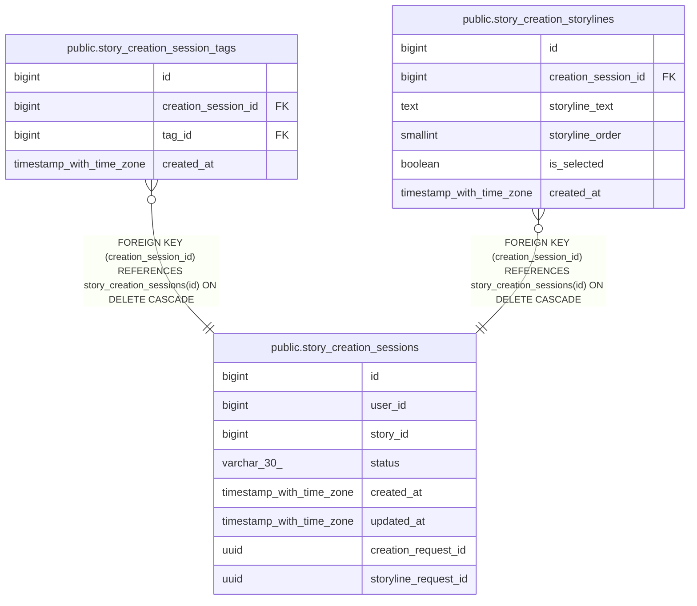

# public.story_creation_sessions

## Columns

| Name | Type | Default | Nullable | Children | Parents | Comment |
| ---- | ---- | ------- | -------- | -------- | ------- | ------- |
| id | bigint | nextval('story_creation_sessions_id_seq'::regclass) | false | [public.story_creation_session_tags](public.story_creation_session_tags.md) [public.story_creation_storylines](public.story_creation_storylines.md) |  |  |
| user_id | bigint |  | true |  |  |  |
| story_id | bigint |  | true |  |  |  |
| status | varchar(30) |  | false |  |  |  |
| created_at | timestamp with time zone | now() | false |  |  |  |
| updated_at | timestamp with time zone | now() | false |  |  |  |
| creation_request_id | uuid |  | true |  |  | KNK-644: 완성(STORY_CREATED) 시점 요청의 request_id. 회수 재실행 검증용이며 storyline_request_id(스토리라인 단계)와 다른 값이다. |
| storyline_request_id | uuid |  | true |  |  | KNK-751: 스토리라인 생성(STORYLINE_GENERATION) 요청의 request_id. AI trace 여정을 묶는 creation_id로 헤더에 실린다. 이 컬럼 도입 전 세션은 NULL(헤더 생략). |

## Constraints

| Name | Type | Definition |
| ---- | ---- | ---------- |
| ck_story_creation_sessions_status | CHECK | CHECK (((status)::text = ANY ((ARRAY['STORYLINES_GENERATED'::character varying, 'STORY_CREATED'::character varying])::text[]))) |
| story_creation_sessions_pkey | PRIMARY KEY | PRIMARY KEY (id) |

## Indexes

| Name | Definition |
| ---- | ---------- |
| story_creation_sessions_pkey | CREATE UNIQUE INDEX story_creation_sessions_pkey ON public.story_creation_sessions USING btree (id) |
| idx_story_creation_sessions_story | CREATE INDEX idx_story_creation_sessions_story ON public.story_creation_sessions USING btree (story_id) |

## Relations

```mermaid
erDiagram

"public.story_creation_session_tags" }o--|| "public.story_creation_sessions" : "FOREIGN KEY (creation_session_id) REFERENCES story_creation_sessions(id) ON DELETE CASCADE"
"public.story_creation_storylines" }o--|| "public.story_creation_sessions" : "FOREIGN KEY (creation_session_id) REFERENCES story_creation_sessions(id) ON DELETE CASCADE"

"public.story_creation_sessions" {
  bigint id
  bigint user_id
  bigint story_id
  varchar_30_ status
  timestamp_with_time_zone created_at
  timestamp_with_time_zone updated_at
  uuid creation_request_id
  uuid storyline_request_id
}
"public.story_creation_session_tags" {
  bigint id
  bigint creation_session_id FK
  bigint tag_id FK
  timestamp_with_time_zone created_at
}
"public.story_creation_storylines" {
  bigint id
  bigint creation_session_id FK
  text storyline_text
  smallint storyline_order
  boolean is_selected
  timestamp_with_time_zone created_at
}
```

---

> Generated by [tbls](https://github.com/k1LoW/tbls)
