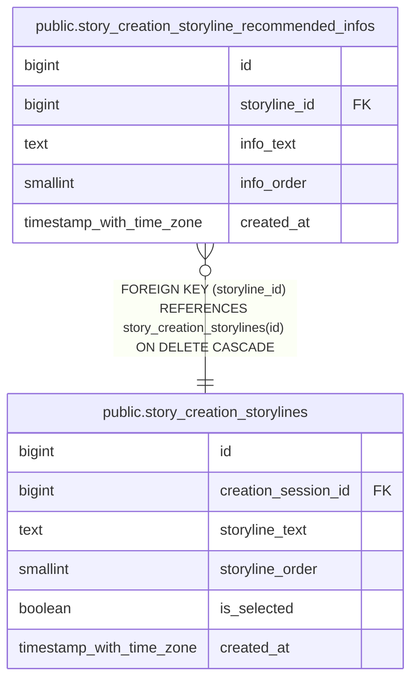

# public.story_creation_storyline_recommended_infos

## Columns

| Name | Type | Default | Nullable | Children | Parents | Comment |
| ---- | ---- | ------- | -------- | -------- | ------- | ------- |
| id | bigint | nextval('story_creation_storyline_recommended_infos_id_seq'::regclass) | false |  |  |  |
| storyline_id | bigint |  | false |  | [public.story_creation_storylines](public.story_creation_storylines.md) |  |
| info_text | text |  | false |  |  |  |
| info_order | smallint |  | false |  |  |  |
| created_at | timestamp with time zone | now() | false |  |  |  |

## Constraints

| Name | Type | Definition |
| ---- | ---- | ---------- |
| ck_story_creation_storyline_recommended_infos_order | CHECK | CHECK ((info_order > 0)) |
| story_creation_storyline_recommended_infos_storyline_id_fkey | FOREIGN KEY | FOREIGN KEY (storyline_id) REFERENCES story_creation_storylines(id) ON DELETE CASCADE |
| story_creation_storyline_recommended_infos_pkey | PRIMARY KEY | PRIMARY KEY (id) |
| uq_story_creation_storyline_recommended_infos_order | UNIQUE | UNIQUE (storyline_id, info_order) |

## Indexes

| Name | Definition |
| ---- | ---------- |
| story_creation_storyline_recommended_infos_pkey | CREATE UNIQUE INDEX story_creation_storyline_recommended_infos_pkey ON public.story_creation_storyline_recommended_infos USING btree (id) |
| uq_story_creation_storyline_recommended_infos_order | CREATE UNIQUE INDEX uq_story_creation_storyline_recommended_infos_order ON public.story_creation_storyline_recommended_infos USING btree (storyline_id, info_order) |

## Relations

---

> Generated by [tbls](https://github.com/k1LoW/tbls)
