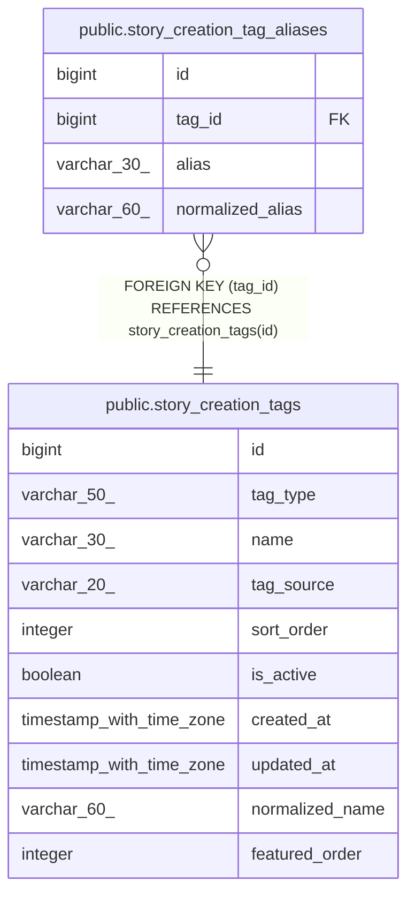

# public.story_creation_tag_aliases

## Columns

| Name | Type | Default | Nullable | Children | Parents | Comment |
| ---- | ---- | ------- | -------- | -------- | ------- | ------- |
| id | bigint | nextval('story_creation_tag_aliases_id_seq'::regclass) | false |  |  |  |
| tag_id | bigint |  | false |  | [public.story_creation_tags](public.story_creation_tags.md) |  |
| alias | varchar(30) |  | false |  |  |  |
| normalized_alias | varchar(60) |  | false |  |  |  |

## Constraints

| Name | Type | Definition |
| ---- | ---- | ---------- |
| story_creation_tag_aliases_tag_id_fkey | FOREIGN KEY | FOREIGN KEY (tag_id) REFERENCES story_creation_tags(id) |
| story_creation_tag_aliases_pkey | PRIMARY KEY | PRIMARY KEY (id) |
| story_creation_tag_aliases_normalized_alias_key | UNIQUE | UNIQUE (normalized_alias) |

## Indexes

| Name | Definition |
| ---- | ---------- |
| story_creation_tag_aliases_pkey | CREATE UNIQUE INDEX story_creation_tag_aliases_pkey ON public.story_creation_tag_aliases USING btree (id) |
| story_creation_tag_aliases_normalized_alias_key | CREATE UNIQUE INDEX story_creation_tag_aliases_normalized_alias_key ON public.story_creation_tag_aliases USING btree (normalized_alias) |
| idx_story_creation_tag_aliases_tag_id | CREATE INDEX idx_story_creation_tag_aliases_tag_id ON public.story_creation_tag_aliases USING btree (tag_id) |

## Relations

---

> Generated by [tbls](https://github.com/k1LoW/tbls)
