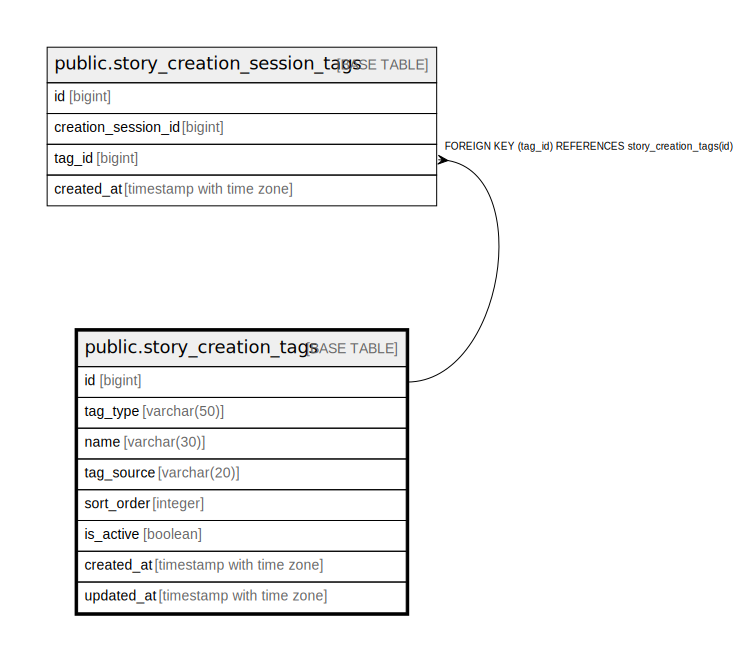

# public.story_creation_tags

## Columns

| Name | Type | Default | Nullable | Children | Parents | Comment |
| ---- | ---- | ------- | -------- | -------- | ------- | ------- |
| id | bigint | nextval('story_creation_tags_id_seq'::regclass) | false | [public.story_creation_session_tags](public.story_creation_session_tags.md) |  |  |
| tag_type | varchar(50) |  | false |  |  |  |
| name | varchar(30) |  | false |  |  |  |
| tag_source | varchar(20) |  | false |  |  |  |
| sort_order | integer |  | false |  |  |  |
| is_active | boolean | true | false |  |  |  |
| created_at | timestamp with time zone | now() | false |  |  |  |
| updated_at | timestamp with time zone | now() | false |  |  |  |

## Constraints

| Name | Type | Definition |
| ---- | ---- | ---------- |
| ck_story_creation_tags_sort_order | CHECK | CHECK ((sort_order >= 0)) |
| ck_story_creation_tags_tag_source | CHECK | CHECK (((tag_source)::text = ANY ((ARRAY['PREDEFINED'::character varying, 'CUSTOM'::character varying])::text[]))) |
| ck_story_creation_tags_tag_type | CHECK | CHECK (((tag_type)::text = ANY ((ARRAY['GENRE'::character varying, 'PROTAGONIST'::character varying, 'SUPPORTING_CHARACTER'::character varying])::text[]))) |
| story_creation_tags_pkey | PRIMARY KEY | PRIMARY KEY (id) |
| uq_story_creation_tags_source_type_name | UNIQUE | UNIQUE (tag_source, tag_type, name) |

## Indexes

| Name | Definition |
| ---- | ---------- |
| story_creation_tags_pkey | CREATE UNIQUE INDEX story_creation_tags_pkey ON public.story_creation_tags USING btree (id) |
| idx_story_creation_tags_lookup | CREATE INDEX idx_story_creation_tags_lookup ON public.story_creation_tags USING btree (tag_source, is_active, tag_type, sort_order, id) |
| uq_story_creation_tags_source_type_name | CREATE UNIQUE INDEX uq_story_creation_tags_source_type_name ON public.story_creation_tags USING btree (tag_source, tag_type, name) |

## Relations

---

> Generated by [tbls](https://github.com/k1LoW/tbls)
