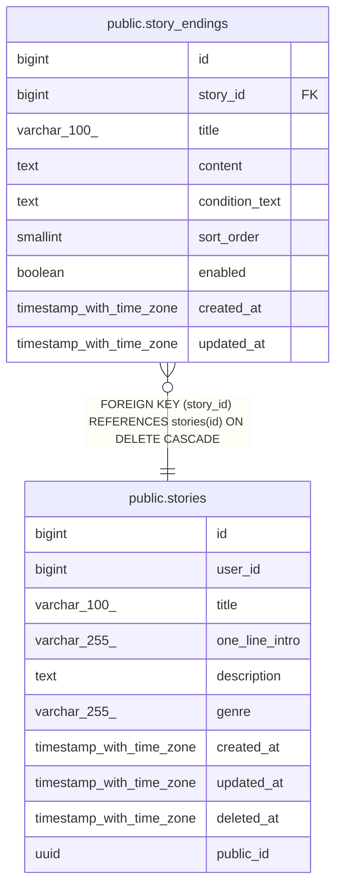

# public.story_endings

## Columns

| Name | Type | Default | Nullable | Children | Parents | Comment |
| ---- | ---- | ------- | -------- | -------- | ------- | ------- |
| id | bigint | nextval('story_endings_id_seq'::regclass) | false |  |  |  |
| story_id | bigint |  | false |  | [public.stories](public.stories.md) |  |
| title | varchar(100) |  | false |  |  |  |
| content | text |  | false |  |  |  |
| condition_text | text |  | true |  |  |  |
| sort_order | smallint |  | false |  |  |  |
| enabled | boolean | true | false |  |  |  |
| created_at | timestamp with time zone | now() | false |  |  |  |
| updated_at | timestamp with time zone | now() | false |  |  |  |

## Constraints

| Name | Type | Definition |
| ---- | ---- | ---------- |
| ck_story_endings_order | CHECK | CHECK ((sort_order > 0)) |
| story_endings_story_id_fkey | FOREIGN KEY | FOREIGN KEY (story_id) REFERENCES stories(id) ON DELETE CASCADE |
| story_endings_pkey | PRIMARY KEY | PRIMARY KEY (id) |
| uq_story_endings_order | UNIQUE | UNIQUE (story_id, sort_order) |

## Indexes

| Name | Definition |
| ---- | ---------- |
| story_endings_pkey | CREATE UNIQUE INDEX story_endings_pkey ON public.story_endings USING btree (id) |
| uq_story_endings_order | CREATE UNIQUE INDEX uq_story_endings_order ON public.story_endings USING btree (story_id, sort_order) |

## Relations

---

> Generated by [tbls](https://github.com/k1LoW/tbls)
