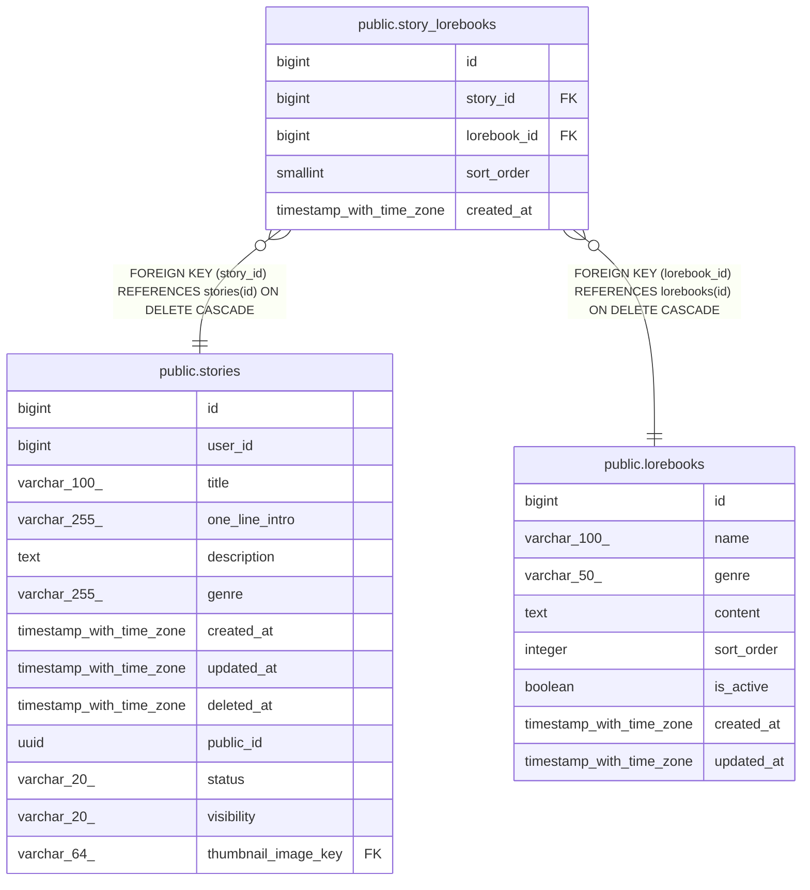

# public.story_lorebooks

## Columns

| Name | Type | Default | Nullable | Children | Parents | Comment |
| ---- | ---- | ------- | -------- | -------- | ------- | ------- |
| id | bigint | nextval('story_lorebooks_id_seq'::regclass) | false |  |  |  |
| story_id | bigint |  | false |  | [public.stories](public.stories.md) |  |
| lorebook_id | bigint |  | false |  | [public.lorebooks](public.lorebooks.md) |  |
| sort_order | smallint |  | false |  |  |  |
| created_at | timestamp with time zone | now() | false |  |  |  |

## Constraints

| Name | Type | Definition |
| ---- | ---- | ---------- |
| ck_story_lorebooks_sort_order | CHECK | CHECK ((sort_order > 0)) |
| story_lorebooks_story_id_fkey | FOREIGN KEY | FOREIGN KEY (story_id) REFERENCES stories(id) ON DELETE CASCADE |
| story_lorebooks_lorebook_id_fkey | FOREIGN KEY | FOREIGN KEY (lorebook_id) REFERENCES lorebooks(id) ON DELETE CASCADE |
| story_lorebooks_pkey | PRIMARY KEY | PRIMARY KEY (id) |
| uq_story_lorebooks_story_lorebook | UNIQUE | UNIQUE (story_id, lorebook_id) |

## Indexes

| Name | Definition |
| ---- | ---------- |
| story_lorebooks_pkey | CREATE UNIQUE INDEX story_lorebooks_pkey ON public.story_lorebooks USING btree (id) |
| uq_story_lorebooks_story_lorebook | CREATE UNIQUE INDEX uq_story_lorebooks_story_lorebook ON public.story_lorebooks USING btree (story_id, lorebook_id) |

## Relations

---

> Generated by [tbls](https://github.com/k1LoW/tbls)
