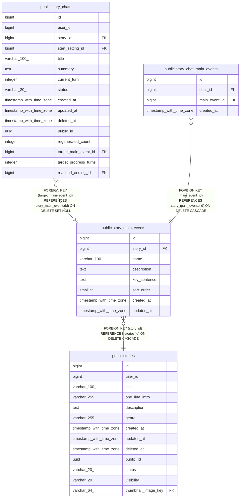

# public.story_main_events

## Columns

| Name | Type | Default | Nullable | Children | Parents | Comment |
| ---- | ---- | ------- | -------- | -------- | ------- | ------- |
| id | bigint | nextval('story_main_events_id_seq'::regclass) | false | [public.story_chats](public.story_chats.md) [public.story_chat_main_events](public.story_chat_main_events.md) |  |  |
| story_id | bigint |  | false |  | [public.stories](public.stories.md) |  |
| name | varchar(100) |  | false |  |  |  |
| description | text |  | false |  |  |  |
| key_sentence | text |  | false |  |  |  |
| sort_order | smallint |  | false |  |  |  |
| created_at | timestamp with time zone | now() | false |  |  |  |
| updated_at | timestamp with time zone | now() | false |  |  |  |

## Constraints

| Name | Type | Definition |
| ---- | ---- | ---------- |
| story_main_events_story_id_fkey | FOREIGN KEY | FOREIGN KEY (story_id) REFERENCES stories(id) ON DELETE CASCADE |
| story_main_events_pkey | PRIMARY KEY | PRIMARY KEY (id) |
| uq_story_main_events_order | UNIQUE | UNIQUE (story_id, sort_order) |

## Indexes

| Name | Definition |
| ---- | ---------- |
| story_main_events_pkey | CREATE UNIQUE INDEX story_main_events_pkey ON public.story_main_events USING btree (id) |
| uq_story_main_events_order | CREATE UNIQUE INDEX uq_story_main_events_order ON public.story_main_events USING btree (story_id, sort_order) |
| idx_story_main_events_story | CREATE INDEX idx_story_main_events_story ON public.story_main_events USING btree (story_id) |

## Relations

---

> Generated by [tbls](https://github.com/k1LoW/tbls)
