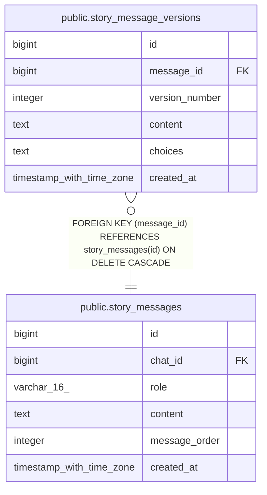

# public.story_message_versions

## Columns

| Name | Type | Default | Nullable | Children | Parents | Comment |
| ---- | ---- | ------- | -------- | -------- | ------- | ------- |
| id | bigint | nextval('story_message_versions_id_seq'::regclass) | false |  |  |  |
| message_id | bigint |  | false |  | [public.story_messages](public.story_messages.md) |  |
| version_number | integer |  | false |  |  |  |
| content | text |  | false |  |  |  |
| choices | text |  | false |  |  |  |
| created_at | timestamp with time zone | now() | false |  |  |  |

## Constraints

| Name | Type | Definition |
| ---- | ---- | ---------- |
| fk_story_message_versions_message | FOREIGN KEY | FOREIGN KEY (message_id) REFERENCES story_messages(id) ON DELETE CASCADE |
| story_message_versions_pkey | PRIMARY KEY | PRIMARY KEY (id) |
| uq_story_message_versions | UNIQUE | UNIQUE (message_id, version_number) |

## Indexes

| Name | Definition |
| ---- | ---------- |
| story_message_versions_pkey | CREATE UNIQUE INDEX story_message_versions_pkey ON public.story_message_versions USING btree (id) |
| uq_story_message_versions | CREATE UNIQUE INDEX uq_story_message_versions ON public.story_message_versions USING btree (message_id, version_number) |
| idx_story_message_versions_message_id | CREATE INDEX idx_story_message_versions_message_id ON public.story_message_versions USING btree (message_id) |

## Relations

---

> Generated by [tbls](https://github.com/k1LoW/tbls)
