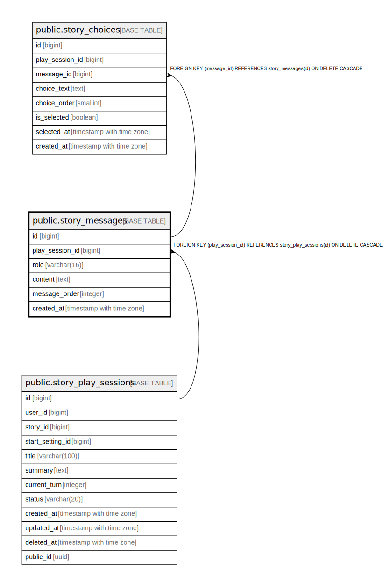

# public.story_messages

## Columns

| Name | Type | Default | Nullable | Children | Parents | Comment |
| ---- | ---- | ------- | -------- | -------- | ------- | ------- |
| id | bigint | nextval('story_messages_id_seq'::regclass) | false | [public.story_choices](public.story_choices.md) |  |  |
| play_session_id | bigint |  | false |  | [public.story_play_sessions](public.story_play_sessions.md) |  |
| role | varchar(16) |  | false |  |  |  |
| content | text |  | false |  |  |  |
| message_order | integer |  | false |  |  |  |
| created_at | timestamp with time zone | now() | false |  |  |  |

## Constraints

| Name | Type | Definition |
| ---- | ---- | ---------- |
| ck_story_messages_order | CHECK | CHECK ((message_order > 0)) |
| ck_story_messages_role | CHECK | CHECK (((role)::text = ANY ((ARRAY['USER'::character varying, 'ASSISTANT'::character varying, 'SYSTEM'::character varying])::text[]))) |
| story_messages_play_session_id_fkey | FOREIGN KEY | FOREIGN KEY (play_session_id) REFERENCES story_play_sessions(id) ON DELETE CASCADE |
| story_messages_pkey | PRIMARY KEY | PRIMARY KEY (id) |
| uq_story_messages_order | UNIQUE | UNIQUE (play_session_id, message_order) |

## Indexes

| Name | Definition |
| ---- | ---------- |
| story_messages_pkey | CREATE UNIQUE INDEX story_messages_pkey ON public.story_messages USING btree (id) |
| uq_story_messages_order | CREATE UNIQUE INDEX uq_story_messages_order ON public.story_messages USING btree (play_session_id, message_order) |

## Relations

---

> Generated by [tbls](https://github.com/k1LoW/tbls)
