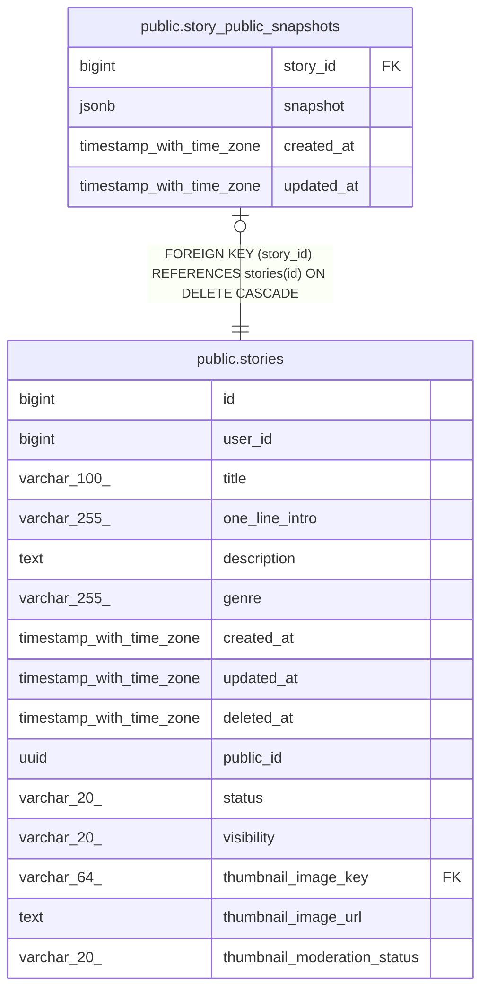

# public.story_public_snapshots

## Description

KNK-1065: 스토리가 마지막으로 공개(PUBLISHED AND PUBLIC)였던 시점의 표시·생성 재료. 읽을 수 없는 스토리를 참조하는 채팅 경로가 현재 값 대신 읽는다.

## Columns

| Name | Type | Default | Nullable | Children | Parents | Comment |
| ---- | ---- | ------- | -------- | -------- | ------- | ------- |
| story_id | bigint |  | false |  | [public.stories](public.stories.md) |  |
| snapshot | jsonb |  | false |  |  |  |
| created_at | timestamp with time zone | now() | false |  |  |  |
| updated_at | timestamp with time zone | now() | false |  |  |  |

## Constraints

| Name | Type | Definition |
| ---- | ---- | ---------- |
| fk_story_public_snapshots_story | FOREIGN KEY | FOREIGN KEY (story_id) REFERENCES stories(id) ON DELETE CASCADE |
| story_public_snapshots_pkey | PRIMARY KEY | PRIMARY KEY (story_id) |

## Indexes

| Name | Definition |
| ---- | ---------- |
| story_public_snapshots_pkey | CREATE UNIQUE INDEX story_public_snapshots_pkey ON public.story_public_snapshots USING btree (story_id) |

## Relations

---

> Generated by [tbls](https://github.com/k1LoW/tbls)
