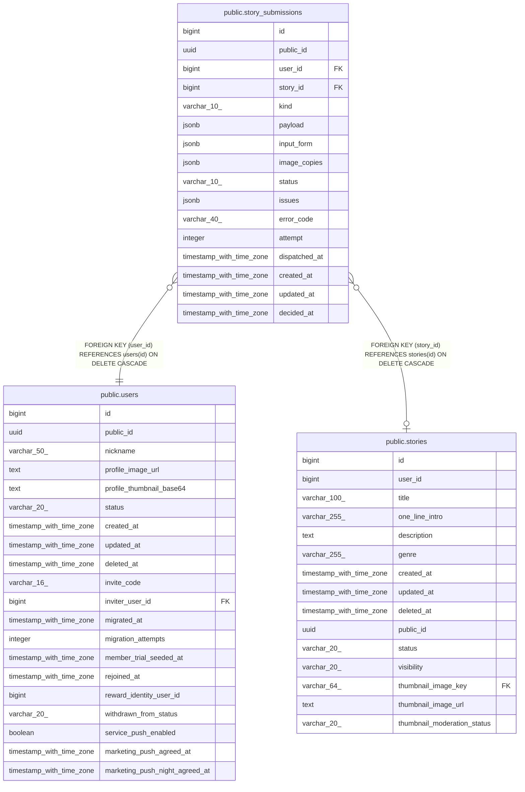

# public.story_submissions

## Description

일반 제작 등록·수정 검수 제출본. 승인 전 라이브와 분리

## Columns

| Name | Type | Default | Nullable | Children | Parents | Comment |
| ---- | ---- | ------- | -------- | -------- | ------- | ------- |
| id | bigint | nextval('story_submissions_id_seq'::regclass) | false |  |  |  |
| public_id | uuid |  | false |  |  |  |
| user_id | bigint |  | false |  | [public.users](public.users.md) |  |
| story_id | bigint |  | true |  | [public.stories](public.stories.md) |  |
| kind | varchar(10) |  | false |  |  |  |
| payload | jsonb |  | false |  |  |  |
| input_form | jsonb |  | false |  |  |  |
| image_copies | jsonb | '{}'::jsonb | false |  |  | 원본 업로드 키 → 서버 전용 불변 복사본 키. 재선점은 재사용, 재제출은 초기화 |
| status | varchar(10) |  | false |  |  |  |
| issues | jsonb | '[]'::jsonb | false |  |  |  |
| error_code | varchar(40) |  | true |  |  |  |
| attempt | integer | 1 | false |  |  | 초기 1, 선점·재제출마다 증가하는 늦은 결과 차단 토큰 |
| dispatched_at | timestamp with time zone |  | true |  |  | NULL은 미선점, 값은 임대 시작 시각. 임대 만료 뒤 재선점 가능 |
| created_at | timestamp with time zone | now() | false |  |  |  |
| updated_at | timestamp with time zone | now() | false |  |  |  |
| decided_at | timestamp with time zone |  | true |  |  |  |

## Constraints

| Name | Type | Definition |
| ---- | ---- | ---------- |
| ck_story_submissions_approved_target | CHECK | CHECK ((((status)::text <> 'APPROVED'::text) OR (story_id IS NOT NULL))) |
| ck_story_submissions_decision | CHECK | CHECK ((((status)::text = 'PENDING'::text) = (decided_at IS NULL))) |
| ck_story_submissions_error | CHECK | CHECK ((((status)::text = 'FAILED'::text) = (error_code IS NOT NULL))) |
| ck_story_submissions_json | CHECK | CHECK (((jsonb_typeof(payload) = 'object'::text) AND (jsonb_typeof(issues) = 'array'::text))) |
| ck_story_submissions_target | CHECK | CHECK ((((kind)::text = 'CREATE'::text) OR (story_id IS NOT NULL))) |
| story_submissions_attempt_check | CHECK | CHECK ((attempt > 0)) |
| story_submissions_image_copies_check | CHECK | CHECK ((jsonb_typeof(image_copies) = 'object'::text)) |
| story_submissions_kind_check | CHECK | CHECK (((kind)::text = ANY ((ARRAY['CREATE'::character varying, 'UPDATE'::character varying])::text[]))) |
| story_submissions_status_check | CHECK | CHECK (((status)::text = ANY ((ARRAY['PENDING'::character varying, 'APPROVED'::character varying, 'REJECTED'::character varying, 'FAILED'::character varying])::text[]))) |
| story_submissions_story_id_fkey | FOREIGN KEY | FOREIGN KEY (story_id) REFERENCES stories(id) ON DELETE CASCADE |
| story_submissions_user_id_fkey | FOREIGN KEY | FOREIGN KEY (user_id) REFERENCES users(id) ON DELETE CASCADE |
| story_submissions_pkey | PRIMARY KEY | PRIMARY KEY (id) |
| story_submissions_public_id_key | UNIQUE | UNIQUE (public_id) |

## Indexes

| Name | Definition |
| ---- | ---------- |
| story_submissions_pkey | CREATE UNIQUE INDEX story_submissions_pkey ON public.story_submissions USING btree (id) |
| story_submissions_public_id_key | CREATE UNIQUE INDEX story_submissions_public_id_key ON public.story_submissions USING btree (public_id) |
| uq_story_submissions_pending | CREATE UNIQUE INDEX uq_story_submissions_pending ON public.story_submissions USING btree (story_id) WHERE ((story_id IS NOT NULL) AND ((status)::text = 'PENDING'::text)) |
| uq_story_submissions_unapproved | CREATE UNIQUE INDEX uq_story_submissions_unapproved ON public.story_submissions USING btree (story_id) WHERE ((story_id IS NOT NULL) AND ((status)::text <> 'APPROVED'::text)) |
| ix_story_submissions_owner | CREATE INDEX ix_story_submissions_owner ON public.story_submissions USING btree (user_id, created_at DESC, id DESC) |
| ix_story_submissions_claim | CREATE INDEX ix_story_submissions_claim ON public.story_submissions USING btree (id, dispatched_at) WHERE ((status)::text = 'PENDING'::text) |

## Relations

---

> Generated by [tbls](https://github.com/k1LoW/tbls)
