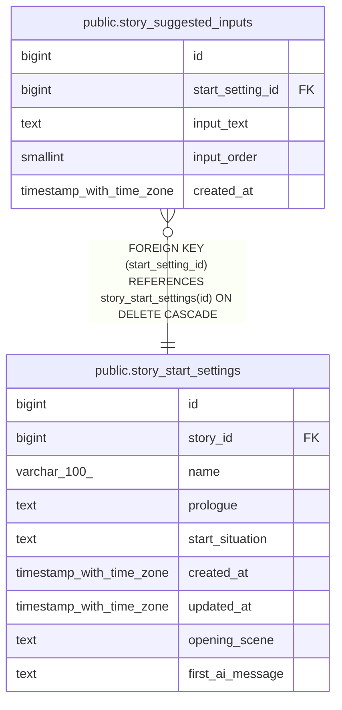

# public.story_suggested_inputs

## Columns

| Name | Type | Default | Nullable | Children | Parents | Comment |
| ---- | ---- | ------- | -------- | -------- | ------- | ------- |
| id | bigint | nextval('story_suggested_inputs_id_seq'::regclass) | false |  |  |  |
| start_setting_id | bigint |  | false |  | [public.story_start_settings](public.story_start_settings.md) |  |
| input_text | text |  | false |  |  |  |
| input_order | smallint |  | false |  |  |  |
| created_at | timestamp with time zone | now() | false |  |  |  |

## Constraints

| Name | Type | Definition |
| ---- | ---- | ---------- |
| ck_story_suggested_inputs_order | CHECK | CHECK ((input_order > 0)) |
| story_suggested_inputs_start_setting_id_fkey | FOREIGN KEY | FOREIGN KEY (start_setting_id) REFERENCES story_start_settings(id) ON DELETE CASCADE |
| story_suggested_inputs_pkey | PRIMARY KEY | PRIMARY KEY (id) |
| uq_story_suggested_inputs_order | UNIQUE | UNIQUE (start_setting_id, input_order) |

## Indexes

| Name | Definition |
| ---- | ---------- |
| story_suggested_inputs_pkey | CREATE UNIQUE INDEX story_suggested_inputs_pkey ON public.story_suggested_inputs USING btree (id) |
| uq_story_suggested_inputs_order | CREATE UNIQUE INDEX uq_story_suggested_inputs_order ON public.story_suggested_inputs USING btree (start_setting_id, input_order) |

## Relations

---

> Generated by [tbls](https://github.com/k1LoW/tbls)
