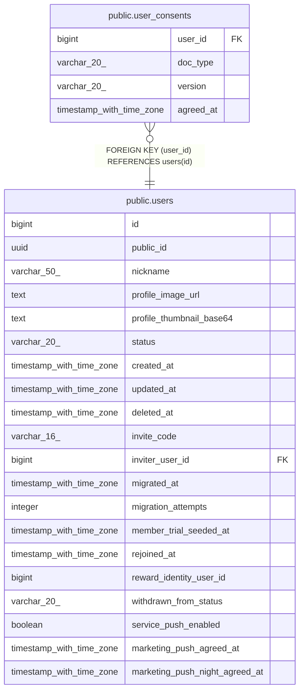

# public.user_consents

## Columns

| Name | Type | Default | Nullable | Children | Parents | Comment |
| ---- | ---- | ------- | -------- | -------- | ------- | ------- |
| user_id | bigint |  | false |  | [public.users](public.users.md) |  |
| doc_type | varchar(20) |  | false |  |  |  |
| version | varchar(20) |  | false |  |  |  |
| agreed_at | timestamp with time zone | now() | false |  |  |  |

## Constraints

| Name | Type | Definition |
| ---- | ---- | ---------- |
| user_consents_doc_type_check | CHECK | CHECK (((doc_type)::text = ANY ((ARRAY['TERMS'::character varying, 'PRIVACY'::character varying, 'AGE14'::character varying])::text[]))) |
| user_consents_user_id_fkey | FOREIGN KEY | FOREIGN KEY (user_id) REFERENCES users(id) |
| user_consents_pkey | PRIMARY KEY | PRIMARY KEY (user_id, doc_type, version) |

## Indexes

| Name | Definition |
| ---- | ---------- |
| user_consents_pkey | CREATE UNIQUE INDEX user_consents_pkey ON public.user_consents USING btree (user_id, doc_type, version) |

## Relations

---

> Generated by [tbls](https://github.com/k1LoW/tbls)
