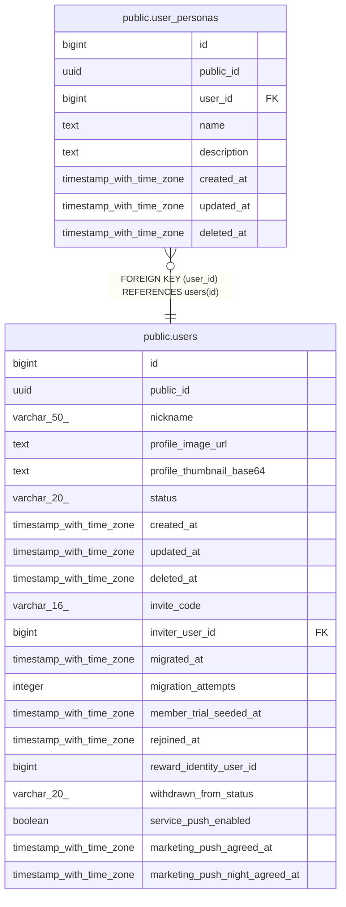

# public.user_personas

## Columns

| Name | Type | Default | Nullable | Children | Parents | Comment |
| ---- | ---- | ------- | -------- | -------- | ------- | ------- |
| id | bigint |  | false |  |  |  |
| public_id | uuid |  | false |  |  |  |
| user_id | bigint |  | false |  | [public.users](public.users.md) |  |
| name | text |  | false |  |  |  |
| description | text |  | false |  |  |  |
| created_at | timestamp with time zone | now() | false |  |  |  |
| updated_at | timestamp with time zone | now() | false |  |  |  |
| deleted_at | timestamp with time zone |  | true |  |  |  |

## Constraints

| Name | Type | Definition |
| ---- | ---- | ---------- |
| user_personas_description_check | CHECK | CHECK (((char_length(description) >= 1) AND (char_length(description) <= 1000))) |
| user_personas_name_check | CHECK | CHECK (((char_length(name) >= 1) AND (char_length(name) <= 20))) |
| user_personas_user_id_fkey | FOREIGN KEY | FOREIGN KEY (user_id) REFERENCES users(id) |
| user_personas_pkey | PRIMARY KEY | PRIMARY KEY (id) |
| user_personas_public_id_key | UNIQUE | UNIQUE (public_id) |

## Indexes

| Name | Definition |
| ---- | ---------- |
| user_personas_pkey | CREATE UNIQUE INDEX user_personas_pkey ON public.user_personas USING btree (id) |
| user_personas_public_id_key | CREATE UNIQUE INDEX user_personas_public_id_key ON public.user_personas USING btree (public_id) |
| idx_user_personas_active_user_created | CREATE INDEX idx_user_personas_active_user_created ON public.user_personas USING btree (user_id, created_at DESC, id DESC) WHERE (deleted_at IS NULL) |

## Relations

---

> Generated by [tbls](https://github.com/k1LoW/tbls)
