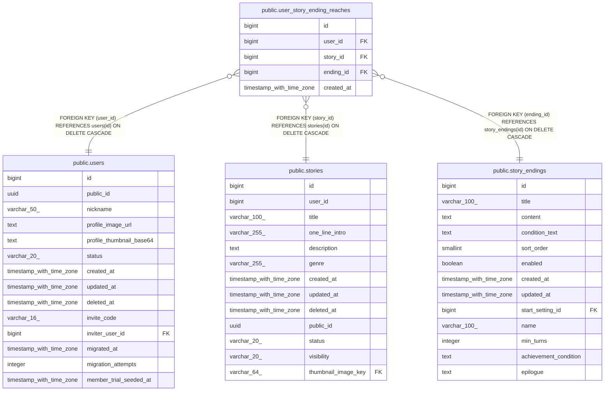

# public.user_story_ending_reaches

## Columns

| Name | Type | Default | Nullable | Children | Parents | Comment |
| ---- | ---- | ------- | -------- | -------- | ------- | ------- |
| id | bigint | nextval('user_story_ending_reaches_id_seq'::regclass) | false |  |  |  |
| user_id | bigint |  | false |  | [public.users](public.users.md) |  |
| story_id | bigint |  | false |  | [public.stories](public.stories.md) |  |
| ending_id | bigint |  | false |  | [public.story_endings](public.story_endings.md) |  |
| created_at | timestamp with time zone | now() | false |  |  |  |

## Constraints

| Name | Type | Definition |
| ---- | ---- | ---------- |
| fk_user_story_ending_reaches_story | FOREIGN KEY | FOREIGN KEY (story_id) REFERENCES stories(id) ON DELETE CASCADE |
| fk_user_story_ending_reaches_user | FOREIGN KEY | FOREIGN KEY (user_id) REFERENCES users(id) ON DELETE CASCADE |
| fk_user_story_ending_reaches_ending | FOREIGN KEY | FOREIGN KEY (ending_id) REFERENCES story_endings(id) ON DELETE CASCADE |
| user_story_ending_reaches_pkey | PRIMARY KEY | PRIMARY KEY (id) |
| uq_user_story_ending_reaches | UNIQUE | UNIQUE (user_id, story_id, ending_id) |

## Indexes

| Name | Definition |
| ---- | ---------- |
| user_story_ending_reaches_pkey | CREATE UNIQUE INDEX user_story_ending_reaches_pkey ON public.user_story_ending_reaches USING btree (id) |
| uq_user_story_ending_reaches | CREATE UNIQUE INDEX uq_user_story_ending_reaches ON public.user_story_ending_reaches USING btree (user_id, story_id, ending_id) |
| idx_user_story_ending_reaches_user_story | CREATE INDEX idx_user_story_ending_reaches_user_story ON public.user_story_ending_reaches USING btree (user_id, story_id) |

## Relations

---

> Generated by [tbls](https://github.com/k1LoW/tbls)
